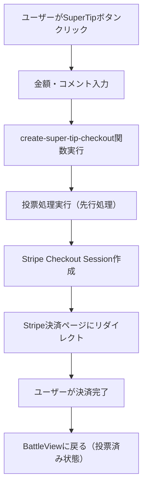
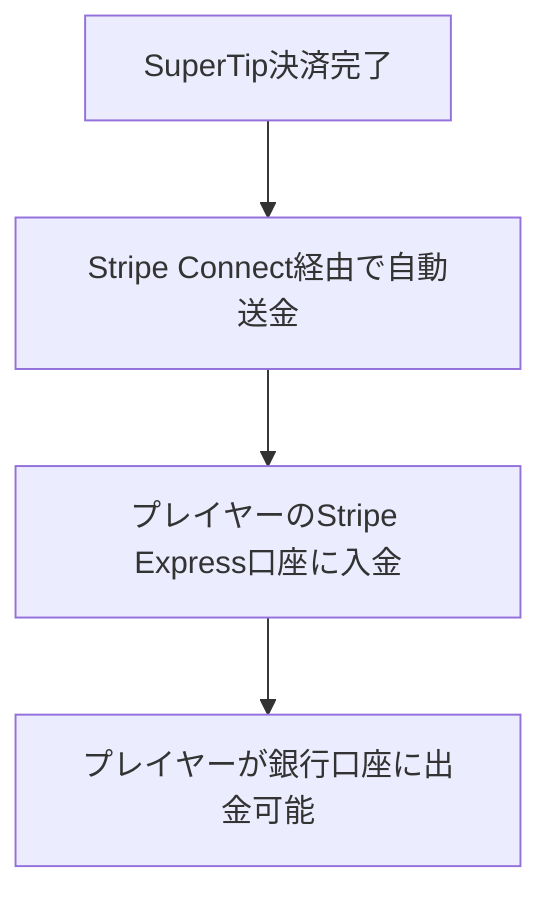

# BeatNexus SuperTip機能 完全仕様書

## 📅 作成日: 2025年8月26日
## 🎯 目的: SuperTip機能の完全な設計・実装仕様

---

## 📋 **概要**

SuperTipは、BeatNexusプラットフォームでビートボクサーを金銭的に支援しながら投票できる機能です。YouTube SuperChatに似た仕組みで、ファンがプレイヤーに直接支援金を送ることができます。

### 🚧 **現在のステータス**
**⚠️ 重要**: SuperTip機能は現在**実装・テスト段階**です。
- **本番環境**: 機能フラグにより**完全非表示**
- **開発環境**: 機能フラグにより**有効化**してテスト可能
- **段階的リリース**: 十分なテスト後に本番環境で段階的に公開予定

### 🎯 **目標**
- プレイヤーの収益化支援
- ファンの応援体験向上  
- プラットフォームの持続可能な収益モデル構築
- 安全で透明性の高い決済システム

---

## 💰 **基本仕様**

### 金額設定
- **最小金額**: ¥100
- **最大金額**: ¥10,000
- **プリセット金額**: ¥100, ¥300, ¥500, ¥1,000
- **カスタム金額**: ¥100-¥10,000の範囲で自由設定

### 手数料構造
- **プラットフォーム手数料**: 10%
- **Stripe決済手数料**: 3.6% (Stripeが自動徴収)
- **受取額計算**: 金額 - (金額 × 0.1) = プレイヤー受取額

### 例: ¥1,000のSuperTip
```
支払金額: ¥1,000
プラットフォーム手数料: ¥100 (10%)
プレイヤー受取額: ¥900
Stripe手数料: ¥36 (3.6%, Stripeが別途徴収)
```

---

## 🏗️ **システム構成**

### フロントエンド
```
src/
├── components/
│   ├── voting/
│   │   └── SuperTipVoteModal.tsx     # SuperTip投票モーダル
│   └── ui/
│       └── VoteCommentModal.tsx      # 投票コメント（SuperTip統合）
├── hooks/
│   └── useFeatureFlags.ts            # 機能フラグ管理
└── i18n/
    └── locales/
        ├── ja.json                   # 日本語翻訳
        └── en.json                   # 英語翻訳
```

### バックエンド
```
supabase/
├── functions/
│   ├── create-super-tip-checkout/    # Stripe Checkout Session作成
│   ├── create-connect-account/       # プレイヤーStripe Connect設定
│   └── stripe-super-tip-webhook/     # Stripe Webhook処理
└── migrations/
    └── 20250825_create_super_tips_table.sql  # データベース設計
```

---

## 🗄️ **データベース設計**

### super_tips テーブル
```sql
CREATE TABLE super_tips (
  id UUID PRIMARY KEY DEFAULT gen_random_uuid(),
  
  -- 関連情報
  battle_id UUID NOT NULL REFERENCES battles(id) ON DELETE CASCADE,
  sender_id UUID NOT NULL REFERENCES profiles(id) ON DELETE CASCADE,
  recipient_id UUID NOT NULL REFERENCES profiles(id) ON DELETE CASCADE,
  
  -- 投票情報
  vote CHAR(1) CHECK (vote IN ('A', 'B')) NOT NULL,
  comment TEXT NOT NULL CHECK (LENGTH(comment) <= 500),
  
  -- 金額情報（円単位）
  amount INTEGER NOT NULL CHECK (amount >= 100 AND amount <= 10000),
  platform_fee INTEGER NOT NULL DEFAULT 0,
  recipient_amount INTEGER NOT NULL DEFAULT 0,
  
  -- Stripe決済情報
  stripe_payment_intent_id TEXT UNIQUE,
  stripe_transfer_id TEXT,
  
  -- ステータス
  status TEXT NOT NULL DEFAULT 'pending' CHECK (status IN ('pending', 'completed', 'failed', 'cancelled')),
  
  -- タイムスタンプ
  created_at TIMESTAMPTZ NOT NULL DEFAULT NOW(),
  updated_at TIMESTAMPTZ NOT NULL DEFAULT NOW(),
  completed_at TIMESTAMPTZ,
  
  -- 制約
  UNIQUE(sender_id, battle_id) -- 1ユーザー1バトルにつき1回のSuperTip制限
);
```

### 関連テーブル拡張
```sql
-- プロファイルテーブル（Stripe Connect情報）
ALTER TABLE profiles ADD COLUMN stripe_account_id TEXT UNIQUE;
ALTER TABLE profiles ADD COLUMN stripe_onboarding_completed BOOLEAN DEFAULT FALSE;

-- 投票テーブル（SuperTip関連情報）
ALTER TABLE battle_votes ADD COLUMN has_super_tip BOOLEAN DEFAULT FALSE;
ALTER TABLE battle_votes ADD COLUMN super_tip_id UUID REFERENCES super_tips(id);
```

---

## 🔄 **処理フロー**

### 1. SuperTip送信フロー


### 2. プレイヤー収益フロー


---

## 🎨 **UI/UX仕様**

### SuperTipVoteModal
- **金額選択**: プリセットボタン + カスタム入力
- **コメント入力**: 最大500文字
- **投票先選択**: プレイヤーA/B
- **手数料表示**: 透明性確保
- **確認フロー**: 送信前の詳細確認

### 金額別UI演出
```
¥100-500:   銅色エフェクト + 💰アイコン
¥501-2000:  銀色エフェクト + ⭐アイコン  
¥2001-5000: 金色エフェクト + 👑アイコン
¥5001-10000: プラチナエフェクト + 💎アイコン
```

### SuperTipコメント表示
```tsx
// 通常コメントとの差別化
<div className="super-tip-comment">
  <div className="amount-badge">¥{amount}</div>
  <div className="comment-content">{comment}</div>
  <div className="super-tip-icon">💰</div>
</div>
```

---

## 🔒 **セキュリティ・制限**

### 投票制限
- **重複防止**: 1ユーザー1バトルにつき1回のSuperTip
- **取り消し制限**: SuperTip付き投票は取り消し不可
- **期限制限**: 投票期間内のみ有効

### 決済セキュリティ
- **Stripe Connect**: 安全な資金移動
- **KYC対応**: プレイヤーの本人確認必須
- **PCI DSS準拠**: カード情報の安全な処理

### データ保護
- **個人情報**: 最小限の収集・暗号化保存
- **決済情報**: Stripe側で管理（非保存）
- **監査ログ**: 全取引の記録・追跡可能

---

## 🚦 **機能フラグ制御**

### 🎭 **段階的リリース戦略**
SuperTip機能は段階的リリースを採用しており、機能フラグによる細かい制御が可能です。

### 環境別設定
```bash
# 本番環境（.env / デプロイ環境変数）
VITE_ENABLE_SUPER_TIP=false  # 🔴 現在非表示

# 開発環境（.env.local / .env.development）
VITE_ENABLE_SUPER_TIP=true   # 🟢 テスト可能
```

### 🔧 **機能制御の詳細**
```typescript
// 実装例: SuperTipVoteModal.tsx
const { isSuperTipEnabled } = useFeatureFlags();

// 機能フラグがfalseの場合、コンポーネント自体が非表示
if (!isSuperTipEnabled) return null;

// VoteCommentModal.tsx内でも条件分岐
{isSuperTipEnabled && (
  <SuperTipSection />
)}
```

### 🚀 **段階的公開計画**
1. **Phase 1**: 開発環境での完全テスト ← **現在ここ**
2. **Phase 2**: 限定ユーザーでのベータテスト
3. **Phase 3**: 段階的な本番環境公開
4. **Phase 4**: 全ユーザーへの完全公開

### コンポーネント制御
```tsx
// useFeatureFlags.ts
export const useFeatureFlags = () => {
  const isSuperTipEnabled = import.meta.env.VITE_ENABLE_SUPER_TIP === 'true';
  return { isSuperTipEnabled };
};

// SuperTipVoteModal.tsx
const { isSuperTipEnabled } = useFeatureFlags();
if (!isSuperTipEnabled) return null;
```

---

## 🌍 **多言語対応**

### 日本語（ja.json）
```json
{
  "superTip": {
    "title": "SuperTip",
    "description": "プレイヤーを支援しながら投票",
    "amount": "金額",
    "comment": "コメント",
    "minAmount": "最小金額は¥100です",
    "maxAmount": "最大金額は¥10,000です",
    "processingFee": "手数料",
    "recipientAmount": "プレイヤー受取額",
    "submit": "SuperTipで投票",
    "success": "SuperTip投票が完了しました！",
    "error": "SuperTip処理でエラーが発生しました",
    "cannotCancel": "SuperTip付きの投票は取り消しできません",
    "stripeNotSetup": "このプレイヤーはSuperTipを受け取れません"
  }
}
```

### 英語（en.json）
```json
{
  "superTip": {
    "title": "SuperTip",
    "description": "Support players while voting",
    "amount": "Amount",
    "comment": "Comment",
    "minAmount": "Minimum amount is ¥100",
    "maxAmount": "Maximum amount is ¥10,000",
    "processingFee": "Processing Fee",
    "recipientAmount": "Player Receives",
    "submit": "Vote with SuperTip",
    "success": "SuperTip vote completed successfully!",
    "error": "An error occurred processing SuperTip",
    "cannotCancel": "SuperTip votes cannot be canceled",
    "stripeNotSetup": "This player cannot receive SuperTips"
  }
}
```

---

## ⚙️ **設定・環境変数**

### Stripe設定
```bash
# 開発環境
STRIPE_SECRET_KEY=sk_test_...
STRIPE_PUBLISHABLE_KEY=pk_test_...
STRIPE_WEBHOOK_SECRET=whsec_...

# 本番環境
STRIPE_SECRET_KEY=sk_live_...
STRIPE_PUBLISHABLE_KEY=pk_live_...
STRIPE_WEBHOOK_SECRET=whsec_...
```

### Supabase設定
```bash
# 開発環境
SUPABASE_URL=https://wdttluticnlqzmqmfvgt.supabase.co
SUPABASE_ANON_KEY=eyJhbGciOiJIUzI1NiIsInR5cCI6IkpXVCJ9...

# 本番環境
SUPABASE_URL=https://qgqcjtjxaoplhxurbpis.supabase.co
SUPABASE_ANON_KEY=eyJhbGciOiJIUzI1NiIsInR5cCI6IkpXVCJ9...
```

### その他設定
```bash
FRONTEND_URL=https://beatnexus.com
VITE_ENABLE_SUPER_TIP=true
```

---

## 🧪 **テスト仕様**

### テスト用データ
```bash
# Stripe テストカード
4242 4242 4242 4242  # 成功
4000 0000 0000 0002  # カード拒否
4000 0000 0000 9995  # 残高不足

# テスト用メールアドレス
test@example.com
beatnexus.test@gmail.com
```

### テストシナリオ
1. **正常フロー**: 金額入力 → 決済完了 → 投票反映
2. **エラーケース**: カード拒否 → エラー表示 → 投票未反映
3. **制限チェック**: 重複投票防止 → エラー表示
4. **UI確認**: レスポンシブ + 多言語表示

---

## 📊 **統計・分析**

### 集計データ
```sql
-- SuperTip統計ビュー
CREATE VIEW super_tip_stats AS
SELECT 
  battle_id,
  COUNT(*) as total_super_tips,
  SUM(amount) as total_amount,
  SUM(recipient_amount) as total_recipient_amount,
  SUM(platform_fee) as total_platform_fee,
  AVG(amount) as average_amount,
  COUNT(CASE WHEN vote = 'A' THEN 1 END) as vote_a_super_tips,
  COUNT(CASE WHEN vote = 'B' THEN 1 END) as vote_b_super_tips
FROM super_tips 
WHERE status = 'completed'
GROUP BY battle_id;
```

### 表示項目
- バトル別SuperTip総額
- プレイヤー別受取額
- 月間収益統計
- 平均SuperTip金額

---

## 🚀 **デプロイ手順**

### 1. 開発環境準備
```bash
# 環境変数設定
cp .env.development .env.local

# 依存関係インストール
pnpm install

# 開発サーバー起動
npm run dev
```

### 2. 本番環境デプロイ
```bash
# マイグレーション適用
npx supabase db push --project-ref qgqcjtjxaoplhxurbpis

# Edge Functions デプロイ
npx supabase functions deploy create-super-tip-checkout --project-ref qgqcjtjxaoplhxurbpis
npx supabase functions deploy create-connect-account --project-ref qgqcjtjxaoplhxurbpis

# フロントエンド デプロイ（Vercel等）
npm run build
```

### 3. 設定確認
- Stripe Connect アプリケーション設定
- Webhook エンドポイント設定
- 環境変数設定確認

---

## 🔮 **将来の拡張計画**

### Phase 2: 高度な機能
- 📈 **SuperTip ランキング**: 月間支援額ランキング
- 🎁 **限定バッジ**: 高額支援者への特別バッジ
- 📱 **モバイル最適化**: アプリ版SuperTip
- 🔔 **通知システム**: SuperTip受取通知

### Phase 3: エンタープライズ機能
- 📊 **詳細分析**: 収益分析ダッシュボード
- 🏢 **企業スポンサー**: 企業による支援機能
- 🌍 **国際対応**: 多通貨・多地域対応
- 🤖 **AI推奨**: おすすめ支援額AI

---

## 📝 **変更履歴**

- **2025-08-26**: 初回作成（基本機能実装完了）
- **2025-08-26**: 機能フラグ制御追加
- **2025-08-26**: 完全仕様書統合
- **2025-08-26**: 本番環境非表示ステータス追加・段階的リリース計画明記

---

## ⚠️ **重要な注意事項**

### 🚫 **本番環境での現在の状態**
- SuperTip機能は**完全に非表示**です
- ユーザーはSuperTip関連のUIを一切見ることができません
- 決済処理やデータベース操作も実行されません

### 🔧 **開発者向け情報**
- 開発環境でのテストには `.env.local` で `VITE_ENABLE_SUPER_TIP=true` を設定
- 本番デプロイ時は必ず `VITE_ENABLE_SUPER_TIP=false` を確認
- 段階的公開時は環境変数の段階的変更で制御可能

---

## 📞 **サポート・連絡先**

技術的な質問や問題については、開発チームまでお問い合わせください。

**SuperTip機能により、BeatNexusプラットフォームの持続可能な成長と、クリエイターの収益化を実現します。** 🎵💰
