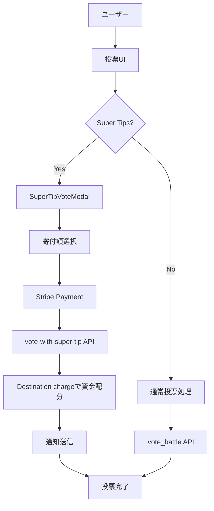

# BeatNexus Super Tips機能仕様書

**最終更新**: 2025年9月1日  
**バージョン**: v1.1 (最新推奨に更新)  
**適用環境**: 開発環境・本番環境

## 📋 目次
1. [概要](#概要)
2. [機能要件](#機能要件)
3. [システム設計](#システム設計)
4. [データベーススキーマ](#データベーススキーマ)
5. [API設計（Edge Functions）](#api設計edge-functions)
6. [フロントエンド設計](#フロントエンド設計)
7. [セキュリティ・制限事項](#セキュリティ制限事項)
8. [実装ステップ](#実装ステップ)
9. [テスト計画](#テスト計画)

---

## 概要

BeatNexusのSuper Tips機能は、投票者がバトル投票時に応援したいビートボクサーに寄付を行えるほか、投票と無関係にプレイヤーへ直接支援もできる仕組みです。Stripe Connectを使用し、プラットフォーム手数料を差し引いた金額をバトラーが受け取ります。

### 主要特徴
- **投票と寄付の統合**: 通常の投票に寄付機能を追加（チェックで有効化）
- **単独支援**: 投票と関係なくプレイヤー名横のボタンからいつでも支援可能
- **直接送金**: Stripe Connect経由でバトラーに直接送金
- **投票結果非影響**: 寄付額は投票結果に影響しない
- **最小DB設計**: 必要最小限の情報のみDB保持、詳細はStripeで管理

### 🏗️ 設計哲学：「必要最小限のDB保持」

**DBに保持する理由**：
- **アプリ機能要件**: 投票時の受取人判定、寄付可能性チェック
- **パフォーマンス**: バトル表示での高速判定（Stripe API不要）
- **データ整合性**: 投票と寄付の関連付け、ランキング計算

**Stripeに委ねる情報**：
- **アカウント詳細**: KYC状況、銀行口座情報、国情報
- **決済詳細**: 手数料計算、Transfer状況、詳細ログ
- **コンプライアンス**: 規制要件、税務情報

---

## 機能要件

### 🎯 基本概念

投票者が以下の流れで寄付を行います：

1. **バトル選択**: アクティブなバトルを表示
2. **プレイヤー選択**: A/Bプレイヤーのいずれかを選択
3. **寄付額選択**: プリセットまたはカスタム金額を入力
4. **コメント入力**: 応援メッセージ（必須）
5. **決済処理**: Stripe Connectで直接送金
6. **投票完了**: 既存投票システムと同様にポイント付与（コメント付き投票として+3ポイント）

### 💰 金額設定

| 項目 | 値 |
|------|-----|
| 最小寄付額 | ¥100 |
| 最大寄付額 | ¥10,000 |
| プリセット金額 | ¥100, ¥300, ¥500, ¥1,000, ¥3,000 |
| カスタム金額 | 手動入力可能（¥100-¥10,000の範囲） |
| プラットフォーム手数料 | 10% |

### 🎯 投票ポイントシステム統合

Super Tips投票は既存の投票機能と完全に統合され、同様のポイントシステムが適用されます。

#### ポイント付与ルール
Super Tips投票は**コメント付き投票**として扱われ、以下のポイントが付与されます：

| シーズン状態 | vote_count増加 | season_vote_points増加 |
|-------------|----------------|----------------------|
| **シーズンアクティブ** | +3 | +3 |
| **シーズン非アクティブ** | +3 | +0 |

#### 既存投票機能との整合性
- **通常投票**: +1ポイント（コメントなし）
- **コメント付き投票**: +3ポイント（コメントあり）  
- **Super Tips投票**: +3ポイント（コメント必須 + 寄付）

#### レスポンス形式
```json
{
  "success": true,
  "vote": "A",
  "comment": "リズムが完璧！応援してます！🎵",
  "super_tip_amount": 1000,
  "season_id": "3bb457fc-c694-4035-926d-7990ceb50589",
  "season_found": true,
  "season_vote_points_added": 3,
  "vote_count_added": 3,
  "vote_type": "super_tip_vote",
  "payment_intent_client_secret": "pi_xxx_secret_xxx"
}
```

### 🏦 Stripe Connect要件

#### Connect Account作成
- **アカウントタイプ**: Express Account
- **必要な権限**: `transfers`, `card_payments`
- **KYC**: Stripeの標準KYCプロセス
- **オンボーディング**: Account Linksを使用

#### Connect Account管理
- **アカウント情報**: StripeのAPIで管理（詳細情報はStripe側）
- **DB保存**: `stripe_connect_account_id`と`stripe_charges_enabled`のみ
- **ダッシュボード**: Stripe Expressダッシュボードにリダイレクト
- **状況確認**: 必要時にStripe APIで最新状況を取得

### 🔒 制限事項

| 制限項目 | 内容 |
|----------|------|
| 自己寄付 | バトル参加者は自分のバトルに寄付不可 |
| 重複寄付 | 1ユーザー1バトルにつき1回のみ |
| アーカイブ | 終了済みバトルには寄付不可 |
| Connect未設定 | Connect account未設定バトラーには寄付不可 |
| 認証 | ログインユーザーのみ寄付可能 |

---

## システム設計

### 🏗️ アーキテクチャ概要



### 💾 データフロー

1. **投票フロー**:
   ```
   フロントエンド → Edge Function → Stripe API → Database → 通知
   ```

2. **Connect設定フロー**:
   ```
   プロフィール → 1クリック設定 → 即座にStripe KYC → 完了通知
   ```

---

## データベーススキーマ

### 📊 テーブル設計

#### 1. `profiles`テーブル拡張

```sql
-- Stripe Connect関連カラム追加（最小限）
ALTER TABLE public.profiles ADD COLUMN IF NOT EXISTS
  stripe_connect_account_id text UNIQUE,
  stripe_charges_enabled boolean DEFAULT false;

-- インデックス追加
CREATE INDEX IF NOT EXISTS idx_profiles_stripe_connect 
  ON profiles(stripe_connect_account_id) 
  WHERE stripe_connect_account_id IS NOT NULL;

CREATE INDEX IF NOT EXISTS idx_profiles_stripe_charges_enabled 
  ON profiles(stripe_charges_enabled) WHERE stripe_charges_enabled = true;
```

#### 2. `super_tips`テーブル（新規作成）

```sql
-- Super Tips投票記録テーブル
CREATE TABLE IF NOT EXISTS public.super_tips (
  id uuid PRIMARY KEY DEFAULT gen_random_uuid(),
  
  -- 関連情報
  battle_id uuid REFERENCES active_battles(id) ON DELETE CASCADE,
  sender_user_id uuid NOT NULL REFERENCES profiles(id) ON DELETE CASCADE,
  recipient_user_id uuid NOT NULL REFERENCES profiles(id) ON DELETE CASCADE,
  
  -- 投票情報
  vote char(1) CHECK (vote IN ('A', 'B')),
  comment text NOT NULL CHECK (LENGTH(TRIM(comment)) > 0 AND LENGTH(comment) <= 500),
  
  -- 金額情報（円単位）
  amount_jpy integer NOT NULL CHECK (amount_jpy >= 100 AND amount_jpy <= 10000),
  
  -- Stripe情報
  stripe_payment_intent_id text UNIQUE NOT NULL,
  stripe_transfer_id text,
  stripe_connect_account_id text NOT NULL,
  
  -- ステータス
  payment_status text NOT NULL DEFAULT 'pending' 
    CHECK (payment_status IN ('pending', 'processing', 'succeeded', 'failed', 'canceled')),
  transfer_status text DEFAULT 'pending'
    CHECK (transfer_status IN ('pending', 'paid', 'canceled')),
  
  -- タイムスタンプ
  created_at timestamptz NOT NULL DEFAULT now(),
  updated_at timestamptz NOT NULL DEFAULT now(),
  completed_at timestamptz,
  
  -- 制約
  -- 1ユーザー1バトル1寄付制限（バトル指定時のみ）
  CONSTRAINT super_tips_sender_battle_unique UNIQUE (sender_user_id, battle_id) DEFERRABLE INITIALLY IMMEDIATE
);

-- インデックス
CREATE INDEX idx_super_tips_battle_id ON super_tips(battle_id);
CREATE INDEX idx_super_tips_sender ON super_tips(sender_user_id);
CREATE INDEX idx_super_tips_recipient ON super_tips(recipient_user_id);
CREATE INDEX idx_super_tips_status ON super_tips(payment_status, transfer_status);
CREATE INDEX idx_super_tips_created_at ON super_tips(created_at);
CREATE INDEX idx_super_tips_stripe_payment ON super_tips(stripe_payment_intent_id);
```

#### 3. `battle_votes`テーブル拡張

```sql
-- Super Tips関連カラム追加
ALTER TABLE public.battle_votes ADD COLUMN IF NOT EXISTS
  super_tip_id uuid REFERENCES super_tips(id) ON DELETE SET NULL,
  is_super_tip_vote boolean DEFAULT false;

-- インデックス追加  
CREATE INDEX IF NOT EXISTS idx_battle_votes_super_tip 
  ON battle_votes(super_tip_id) WHERE super_tip_id IS NOT NULL;

-- 注意：既存のseason_idカラムを活用してシーズンポイント統合
-- Super Tips投票時もseason_idが設定され、既存のポイントシステムと連携
```

### 🔧 トリガー関数

```sql
-- updated_atカラム自動更新
CREATE OR REPLACE FUNCTION update_super_tips_updated_at()
RETURNS TRIGGER AS $$
BEGIN
  NEW.updated_at = now();
  RETURN NEW;
END;
$$ language 'plpgsql';

CREATE TRIGGER update_super_tips_updated_at_trigger
  BEFORE UPDATE ON super_tips
  FOR EACH ROW EXECUTE FUNCTION update_super_tips_updated_at();
```

-- 追加整合性: バトル未指定のときはvoteはNULL
ALTER TABLE public.super_tips
  ADD CONSTRAINT super_tips_vote_null_when_no_battle
  CHECK (battle_id IS NOT NULL OR vote IS NULL);

-- ユニーク制約をバトル指定時にのみ厳密にするための部分インデックス
CREATE UNIQUE INDEX IF NOT EXISTS ux_super_tips_sender_battle
  ON super_tips(sender_user_id, battle_id) WHERE battle_id IS NOT NULL;

### 📋 RLS (Row Level Security) ポリシー

```sql
-- RLS有効化
ALTER TABLE super_tips ENABLE ROW LEVEL SECURITY;

-- 閲覧ポリシー：送信者・受信者・バトル参加者
CREATE POLICY "Users can view relevant super tips" ON super_tips
  FOR SELECT USING (
    (select auth.uid()) = sender_user_id OR 
    (select auth.uid()) = recipient_user_id OR
    EXISTS (
      SELECT 1 FROM active_battles 
      WHERE active_battles.id = super_tips.battle_id 
      AND ((select auth.uid()) = active_battles.player1_user_id OR (select auth.uid()) = active_battles.player2_user_id)
    )
  );

-- 作成ポリシー：認証済みユーザーが送信者として
CREATE POLICY "Authenticated users can create super tips" ON super_tips
  FOR INSERT WITH CHECK ((select auth.uid()) = sender_user_id);

-- 更新ポリシー：システムのみ（webhook用）
CREATE POLICY "System can update super tips" ON super_tips
  FOR UPDATE USING (true); -- Edge Functionでservice_role使用
```

### 🎯 シーズンポイントシステム統合実装

#### ポイント更新SQL（既存システムと同様）

```sql
-- Super Tips投票時のポイント更新ロジック
CREATE OR REPLACE FUNCTION update_super_tip_vote_points(
  p_user_id uuid,
  p_season_id uuid,
  p_season_found boolean
) RETURNS json
LANGUAGE plpgsql SECURITY DEFINER
AS $$
DECLARE
  v_vote_count_increment INTEGER := 3; -- コメント付き投票として+3
  v_season_vote_points_increment INTEGER := 0;
BEGIN
  -- シーズンがアクティブな場合のみシーズンポイント付与
  IF p_season_found AND p_season_id IS NOT NULL THEN
    v_season_vote_points_increment := 3;
    
    UPDATE public.profiles
    SET 
      vote_count = vote_count + v_vote_count_increment,
      season_vote_points = COALESCE(season_vote_points, 0) + v_season_vote_points_increment,
      updated_at = NOW()
    WHERE id = p_user_id;
  ELSE
    -- シーズン非アクティブ時は通算ポイントのみ
    UPDATE public.profiles
    SET 
      vote_count = vote_count + v_vote_count_increment,
      updated_at = NOW()
    WHERE id = p_user_id;
  END IF;

  RETURN json_build_object(
    'vote_count_added', v_vote_count_increment,
    'season_vote_points_added', v_season_vote_points_increment,
    'season_found', p_season_found
  );
END;
$$;
```

---

## API設計（Edge Functions）

### ⚡ Edge Functions一覧

#### 1. `/setup-super-tip-receiving`

**目的**: Connect Account作成 + オンボーディング開始（1回のAPI call）

```typescript
interface SetupSuperTipReceivingRequest {
  // リクエストボディなし（認証ユーザー情報から取得）
}

interface SetupSuperTipReceivingResponse {
  success: boolean;
  account_id?: string;
  onboarding_url: string;  // 即座にリダイレクト用URL
  error?: string;
}

// 実装フロー（1つのEdge Functionで完結）
1. ユーザー認証確認
2. 既存Connect Accountチェック
3. 新規の場合：Stripe Connect Account作成
4. Account Links作成（オンボーディング）
5. onboarding_urlを即座にレスポンス
6. DB更新：stripe_connect_account_id保存

// 実装概要（最新推奨: Expressアカウント）
const account = await stripe.accounts.create({
  type: 'express',
  country: 'JP',
  business_type: 'individual',
  capabilities: {
    transfers: { requested: true },
    card_payments: { requested: true },
  },
  metadata: {
    platform: 'BeatNexus',
    user_id: user.id,
    purpose: 'super_tips',
  },
});

// 即座にAccount Links作成
const accountLink = await stripe.accountLinks.create({
  account: account.id,
  refresh_url: `${FRONTEND_URL}/profile/stripe-connect?refresh=true`,
  return_url: `${FRONTEND_URL}/profile/stripe-connect?success=true`,
  type: 'account_onboarding'
});

return { 
  success: true, 
  account_id: account.id,
  onboarding_url: accountLink.url 
};
```

#### 2. `/vote-with-super-tip`

**目的**: Super Tips投票処理

```typescript
interface VoteWithSuperTipRequest {
  battle_id: string;
  vote: 'A' | 'B';
  comment: string;
  amount_jpy: number; // 100-10000
}

interface VoteWithSuperTipResponse {
  success: boolean;
  payment_intent_client_secret?: string;
  super_tip_id?: string;
  vote_recorded?: boolean;
  error?: string;
}

// 実装フロー
1. バトル・ユーザー検証
2. 金額・コメント検証
3. 重複チェック
4. **アクティブシーズン確認**（既存投票システムと同様）
5. Payment Intent作成（Destination charges推奨: application_fee_amount + transfer_data.destination + on_behalf_of）
6. super_tipsレコード作成
7. battle_votesレコード作成（season_id含む）
8. **ユーザーポイント更新**（vote_count, season_vote_points）
9. レスポンス返却（ポイント情報含む）
```

#### 3. （任意）`/confirm-super-tip-payment`

**目的**: 決済完了後の処理

```typescript
interface ConfirmSuperTipPaymentRequest {
  payment_intent_id: string;
}

interface ConfirmSuperTipPaymentResponse {
  success: boolean;
  transfer_created?: boolean;
  notification_sent?: boolean;
  error?: string;
}

// 実装フロー
1. Payment Intent確認
2. 決済状況検証
3. Separate charges and transfers方式を採用する場合に使用。Destination charges採用時は不要。
4. super_tipsレコード更新
5. 通知作成
```

#### 4. `/stripe-webhook`

**目的**: Stripe Webhook処理

```typescript
// 処理対象イベント（推奨）
- payment_intent.succeeded
- payment_intent.payment_failed
- account.updated
// Separate charges and transfers方式を使う場合のみ補助で:
// - transfer.updated（必要時）

// 実装フロー
1. Webhook署名検証
2. イベントタイプ判定
3. 対応する処理実行
4. データベース更新
5. 必要に応じて通知送信
```

#### 5. `/get-connect-account-status`

**目的**: Connect Account状況確認

```typescript
interface GetConnectAccountStatusResponse {
  success: boolean;
  has_account: boolean;
  account_id?: string;
  charges_enabled: boolean;
  details_submitted: boolean;
  requirements?: {
    currently_due: string[];
    eventually_due: string[];
    past_due: string[];
  };
  error?: string;
}
```

---

## フロントエンド設計

### 🎨 コンポーネント設計

#### 1. `SuperTipVoteModal`

```typescript
interface SuperTipVoteModalProps {
  isOpen: boolean;
  battleId?: string; // 単独支援では未指定
  player?: 'A' | 'B'; // 単独支援では未指定
  playerName: string;
  recipientStripeAccountId?: string;
  onClose: () => void;
  onSuccess: (result: SuperTipResult) => Promise<void>;
}

interface SuperTipResult {
  super_tip_id: string;
  amount_jpy: number;
  comment: string;
  vote?: 'A' | 'B';
  payment_status: string;
}

// 寄付額プリセット
const TIP_PRESETS = [100, 300, 500, 1000, 3000];
```

**主要機能**:
- 寄付額選択（プリセット + カスタム）
- コメント入力（最大500文字）
- リアルタイム手数料計算表示
- Stripe Elements統合
- エラーハンドリング

#### 2. `StripeConnectOnboarding`

```typescript
interface StripeConnectOnboardingProps {
  userId: string;
  onStatusChange: (status: ConnectStatus) => void;
}

interface ConnectStatus {
  hasAccount: boolean;
  chargesEnabled: boolean;
  detailsSubmitted: boolean;
  requirements: string[];
}
```

**主要機能**:
- 「Super Tip受け取りを設定」ボタン（1クリックでオンボーディング開始）
- 設定状況表示（未設定・設定中・完了済み）
- 必要な追加情報の表示
- Stripe Expressダッシュボードリンク

#### 3. `SuperTipDisplay`

```typescript
interface SuperTipDisplayProps {
  battleId: string;
  player: 'A' | 'B';
}
```

**主要機能**:
- バトル別Super Tips表示
- 寄付額ランキング
- 応援コメント表示
- アニメーション効果

#### 4. コメント表示の統合・優先度（v1.1 追加）

バトル画面のコメントフィードは、以下の2系統のソースを統合して表示します。

- 投票コメント: 既存の RPC `get_battle_comments` の結果（通常/コメント付き投票）
- Super Tipコメント: `super_tips` から該当バトルの支払い成功行（`payment_status = 'succeeded'`）の `comment`

統合ルール:
- まず Super Tipコメントを作成日時の降順で並べて先頭に表示し、その後に投票コメントを続けます。
- 統合用の型は `BattleComment & { isSuperTip?: boolean }` とし、Super Tip由来の行には `isSuperTip = true` を付与します。
- 表示上の区別は任意（例: 「Super Tip」バッジ）。表示有無やスタイル変更は将来のUIガイドラインに従います。

可視性（RLS）:
- `super_tips` は RLS により閲覧可能者が制限されます（送信者・受取人・バトル参加者など）。RLSにより取得できない場合は、その行は表示されません。
- 取得に失敗/0件時は投票コメントのみの表示にフォールバックします。

補足:
- フロントの内部実装では `super_tips` の行に紐づく送信者プロフィール（ユーザー名・アバター）を埋め込み取得し、コメント表示に用います。
- Stripe Webhook により `payment_status` が更新されるため、支払い成功後は自動的にフィード上位に現れます。

#### 5. Super Tip コメントカード・プレビュー（開発用）

目的:
- 金額ティアおよびサイド（A/B/なし）による見た目と発光強度を確認するための開発者向けプレビューページ。

ルート:
- `/dev/supertip-card-preview`

ファイル:
- `src/pages/SuperTipCardPreviewPage.tsx`

スタイル:
- `src/index.css` の `.supertip-card`, `.supertip-side-A/B`, `.supertip-tier-1..4`, `.supertip-badge`

仕様メモ:
- ティア（JPY）: <500=Tier1, 500–999=Tier2, 1000–2999=Tier3, >=3000=Tier4
- レイアウト: 通常コメントと高さを揃えた1行。金額は右端固定（nowrap）。
- モバイル: バッジは明示的に非表示。

### 📱 UI/UX仕様

#### 寄付額選択UI
```typescript
// プリセットボタンデザイン
const presetButtons = [
  { amount: 100, label: '¥100', color: 'bg-gray-600' },
  { amount: 300, label: '¥300', color: 'bg-blue-600' },
  { amount: 500, label: '¥500', color: 'bg-green-600' },
  { amount: 1000, label: '¥1,000', color: 'bg-purple-600' },
  { amount: 3000, label: '¥3,000', color: 'bg-pink-600' }
];

// 手数料表示
const feeDisplay = `
プラットフォーム手数料: ¥${platformFee}
Stripe手数料: ¥${stripeFee}
${playerName}が受け取る金額: ¥${recipientAmount}
`;
```

#### 投票結果表示拡張
```typescript
// Super Tips付き投票の特別表示
const SuperTipComment = {
  background: 'bg-gradient-to-r from-yellow-400 to-orange-500',
  border: 'border-2 border-yellow-400',
  icon: '💰',
  animation: 'animate-pulse'
};

// コメント統合の並び順（概念図）
// [Super Tipコメント (新しい順) ...] + [投票コメント (新しい順) ...]
```

### 🔧 状態管理（Zustand）

```typescript
interface SuperTipStore {
  // 状態
  userConnectStatus: ConnectStatus | null;
  battleSuperTips: Record<string, SuperTip[]>;
  loading: boolean;
  error: string | null;

  // アクション
  fetchConnectStatus: () => Promise<void>;
  createConnectAccount: () => Promise<string>;
  fetchBattleSuperTips: (battleId: string) => Promise<void>;
  createSuperTip: (data: CreateSuperTipData) => Promise<SuperTipResult>;
  refreshUserStatus: () => Promise<void>;
}
```

---

## セキュリティ・制限事項

### 🔒 セキュリティ対策

#### 1. 認証・認可
- **JWT認証**: Supabase Auth必須
- **ユーザー検証**: auth.uid()でのユーザー特定
- **権限チェック**: バトル参加者の自己寄付防止
- **RLS可視性**: `super_tips` のコメントはRLSにより可視性が制限され、許可されたユーザーにのみ表示されます

#### 2. 金額検証
- **フロントエンド**: リアルタイム入力検証
- **バックエンド**: Edge Functionでの二重検証
- **Stripe**: Payment Intent作成時の最終検証

#### 3. 重複防止
- **データベース制約**: UNIQUE(sender_user_id, battle_id)
- **トランザクション**: 同時リクエスト対策
- **アプリケーション**: 既存寄付チェック

#### 4. Webhook検証
```typescript
const sig = req.headers.get('stripe-signature');
const event = stripe.webhooks.constructEvent(body, sig, webhookSecret);
```

### 🚫 制限事項詳細

| 制限項目 | 実装場所 | 検証方法 |
|----------|----------|----------|
| 自己寄付防止 | Edge Function | battle参加者チェック |
| 金額範囲 | Frontend + Backend | ¥100-¥10,000検証 |
| 重複寄付 | Database | UNIQUE制約 |
| Connect必須 | Frontend | recipient_stripe_account_id確認 |
| バトル状態 | Backend | status='ACTIVE'確認 |
| 投票期限 | Backend | end_voting_at確認 |

#### � 既存UIの差分（v1.1）
- VoteCommentModal: Super Tips関連の旧プレースホルダーUIは削除（投票モーダル内統合は後続リリースで検討）。
- BattleView: 単独支援（投票なしで応援）用の導線をプレイヤー名付近に配置予定。支払い完了後のコメントは上記ルールで最上位に表示。
- PostPage: 旧「Monthly Post Limit」セクションを Super Tip受け取り設定カード（`/profile/stripe-connect` への導線）に置換。

### �🛡️ エラーハンドリング

```typescript
// 共通エラータイプ
type SuperTipError = 
  | 'AUTHENTICATION_REQUIRED'
  | 'BATTLE_NOT_FOUND'
  | 'BATTLE_ENDED'
  | 'SELF_TIP_NOT_ALLOWED'
  | 'DUPLICATE_TIP'
  | 'INVALID_AMOUNT'
  | 'RECIPIENT_NOT_CONNECTED'
  | 'PAYMENT_FAILED'
  | 'STRIPE_ERROR';

// エラーメッセージマッピング
const errorMessages: Record<SuperTipError, string> = {
  AUTHENTICATION_REQUIRED: 'ログインが必要です',
  BATTLE_NOT_FOUND: 'バトルが見つかりません',
  BATTLE_ENDED: 'このバトルは終了しています',
  SELF_TIP_NOT_ALLOWED: '自分のバトルには寄付できません',
  DUPLICATE_TIP: 'このバトルには既に寄付済みです',
  INVALID_AMOUNT: '寄付額は¥100-¥10,000の範囲で入力してください',
  RECIPIENT_NOT_CONNECTED: '受取人がStripe Connectを設定していません',
  PAYMENT_FAILED: '決済処理に失敗しました',
  STRIPE_ERROR: 'Stripeエラーが発生しました'
};
```

---

## 実装ステップ

### 📋 Phase 1: データベース・バックエンド

1. **マイグレーション作成**
   ```bash
   # 20250120120000_create_super_tips_system.sql
   - profilesテーブル拡張（Stripe Connect情報）
   - super_tipsテーブル作成
   - battle_votesテーブル拡張（Super Tips関連）
   - RLSポリシー設定
   - シーズンポイント統合関数作成
   ```

2. **Edge Functions実装**
   ```bash
   - setup-super-tip-receiving
   - vote-with-super-tip
   - confirm-super-tip-payment
   - stripe-webhook
   - get-connect-account-status
   ```

3. **環境変数設定**
   ```bash
   STRIPE_SECRET_KEY=sk_test_...
   STRIPE_WEBHOOK_SECRET=whsec_...
   FRONTEND_URL=http://localhost:3000
   ```

### 📋 Phase 2: フロントエンド

1. **コンポーネント実装**
   ```bash
   - components/voting/SuperTipVoteModal.tsx
   - components/profile/StripeConnectOnboarding.tsx
   - components/battle/SuperTipDisplay.tsx
   ```

2. **状態管理**
   ```bash
   - store/superTipStore.ts
   - hooks/useSuperTip.ts
   - hooks/useStripeConnect.ts
   ```

3. **既存コンポーネント拡張**
   ```bash
  - VoteCommentModal.tsx: Super Tipsボタン（現状なし、将来の統合候補）
  - BattleView.tsx: Super Tips表示統合 + 単独支援導線
   - ProfilePage.tsx: Connect設定セクション追加
   ```

### 📋 Phase 3: 統合・テスト

1. **開発環境テスト**
   - Connect Account作成フロー
   - 寄付フロー（成功・失敗パターン）
   - Webhook処理確認

2. **UI/UXテスト**
   - レスポンシブデザイン確認
   - エラーハンドリング確認
   - パフォーマンステスト

3. **本番環境準備**
   - 本番用Stripe設定
   - セキュリティ監査
   - ドキュメント整備

---

## テスト計画

### 🧪 テストケース

#### 1. Connect Account作成
| テストケース | 期待結果 |
|-------------|----------|
| 新規ユーザーがアカウント作成 | アカウント作成成功、オンボーディングURL取得 |
| 既存アカウントで再作成試行 | 既存アカウント情報返却 |
| 未認証ユーザーの作成試行 | 認証エラー |

#### 2. Super Tips投票
| テストケース | 期待結果 |
|-------------|----------|
| 正常な寄付フロー（シーズンアクティブ） | 投票記録、Payment Intent作成、通知送信、+3ポイント（両方） |
| 正常な寄付フロー（シーズン非アクティブ） | 投票記録、Payment Intent作成、通知送信、vote_count+3のみ |
| 自分のバトルに寄付 | エラー：自己寄付不可 |
| 重複寄付 | エラー：重複寄付不可 |
| 無効な金額 | エラー：金額範囲外 |
| Connect未設定相手に寄付 | エラー：受取人未設定 |
| ポイント整合性確認 | 既存の投票機能と同じポイント付与ロジック |

#### 3. 決済処理
| テストケース | 期待結果 |
|-------------|----------|
| 決済成功 | 決済完了（Destination chargesで自動配分）、状況更新、通知送信 |
| 決済失敗 | エラー状況更新、ユーザー通知 |
| Webhook遅延 | リトライ機構動作 |

### 🔍 負荷テスト
- 同時決済処理テスト
- 大量webhook処理テスト
- データベースパフォーマンステスト

### 🐛 エラーシナリオテスト
- Stripe API障害時の処理
- ネットワーク障害時の処理
- データベース障害時の処理

---

## 運用・保守

### 📊 監視項目
- Super Tips作成成功率
- 決済成功率
- Webhook処理時間
- エラー発生率
- Connect Account作成率

### 🔄 定期メンテナンス
- 失敗したTransferの再処理
- 古いPending状態レコードのクリーンアップ
- Connect Account状況の定期同期

### 📝 ログ出力
```typescript
// 重要イベントのログ記録
console.log('SUPER_TIP_CREATED', {
  super_tip_id,
  battle_id,
  amount_jpy,
  payment_intent_id
});

console.log('SUPER_TIP_PAYMENT_SUCCEEDED', {
  super_tip_id,
  transfer_id,
  recipient_amount_jpy
});
```

---

## 付録

### 📚 関連ドキュメント
- [Stripe Connect Documentation](https://stripe.com/docs/connect)
- [投票機能仕様書](./投票機能仕様書.md)
- [BeatNexus.md](./BeatNexus.md) - プロジェクト全体仕様

### 🔗 外部リンク
- [Stripe Connect Japan](https://stripe.com/jp/connect)
- [Account Links API](https://stripe.com/docs/connect/account-links)
- [Express Dashboard](https://stripe.com/docs/connect/express-dashboard)

---

注意: 本仕様は最新のStripe/Supabase推奨に合わせ、Destination charges（transfer_data.destination + application_fee_amount + on_behalf_of）を推奨します。Separate charges and transfersを採用する場合はWebhookイベント・DB項目の扱いを読み替えてください。

**重要**: Super Tips投票は既存の投票ポイントシステム（投票機能仕様書v6準拠）と完全に統合されており、通常の投票機能を損なうことなく拡張されています。
