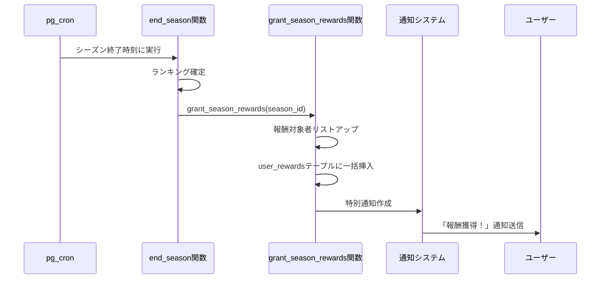

# BeatNexus シーズン報酬システム仕様書

作成日: 2025年7月22日  
最終更新: 2025年7月22日  
対象: シーズン終了時の限定バッジ付与システム

---

## 1. システム概要

### 1.1 目的
シーズンごとの功績（プレイヤーランキング、投票者ランキングなど）に応じて、ユーザーに収集・表示可能な限定バッジを付与することで、ユーザーの努力を「名誉」として可視化し、プロフィールをカスタマイズする楽しみを提供し、プラットフォームへのエンゲージメントを深化させる。

### 1.2 主要機能
- **限定バッジの収集・表示**: シーズン成績に応じた名誉バッジの付与と展示
- **コレクション管理**: 獲得済み・未獲得アイテムの管理と表示
- **自動報酬付与**: シーズン終了時の自動的な報酬配布
- **特別通知**: 報酬獲得時の専用通知システム
- **多言語対応**: 日本語・英語での表示対応

### 1.3 技術スタック
- **データベース**: PostgreSQL (Supabase)
- **フロントエンド**: React + TypeScript + Tailwind CSS
- **状態管理**: Zustand
- **国際化**: react-i18next
- **自動化**: Supabase Edge Functions + pg_cron

### 1.4 実装状況（2025年7月22日現在）
- ✅ データベース設計完了（バッジのみ、フレーム機能削除済み）
- ✅ BadgeCardコンポーネント実装済み（トロフィーマーク・ステータスタグ削除済み）
- ✅ 多言語化対応完了
- ✅ モーダル詳細表示機能実装済み
- ❌ コレクションページ未実装
- ❌ 自動報酬付与システム未実装

---

## 2. データベース設計

### 2.1 rewardsテーブル（マスターデータ）

全てのバッジの「マスターデータ」を管理するテーブル。

```sql
CREATE TABLE rewards (
  id UUID PRIMARY KEY DEFAULT gen_random_uuid(),
  name TEXT NOT NULL,                    -- 報酬名（例: "β Top 8", "Season 1 Champion"）
  description TEXT,                      -- 説明文
  type TEXT NOT NULL CHECK (type IN ('badge')), -- 'badge'のみ（フレーム機能削除）
  image_url TEXT NOT NULL,               -- 画像URL
  season_id UUID REFERENCES seasons(id), -- 関連シーズン（NULL=永続的な報酬）
  rank_requirement INTEGER,             -- 必要ランク（1位, 2位, 3位など、nullの場合は全員）
  min_battles INTEGER DEFAULT 0,        -- 最低バトル数（参加条件）
  is_limited BOOLEAN DEFAULT true,      -- 限定報酬かどうか
  is_active BOOLEAN DEFAULT true,       -- アクティブフラグ
  created_at TIMESTAMPTZ DEFAULT now(),
  updated_at TIMESTAMPTZ DEFAULT now()
);

-- インデックス
CREATE INDEX idx_rewards_season_id ON rewards(season_id);
CREATE INDEX idx_rewards_type ON rewards(type);
```

### 2.2 user_rewardsテーブル（所有権管理）

どのユーザーが、どの報酬を獲得したかを記録する「所有権」を管理するテーブル。

```sql
CREATE TABLE user_rewards (
  id UUID PRIMARY KEY DEFAULT gen_random_uuid(),
  user_id UUID NOT NULL REFERENCES profiles(id) ON DELETE CASCADE,
  reward_id UUID NOT NULL REFERENCES rewards(id) ON DELETE CASCADE,
  earned_at TIMESTAMPTZ DEFAULT now(),
  earned_season_id UUID REFERENCES seasons(id), -- 獲得時のシーズン
  
  -- 制約: 同じユーザーが同じ報酬を複数回獲得することを防ぐ
  UNIQUE(user_id, reward_id)
);

-- インデックス
CREATE INDEX idx_user_rewards_user_id ON user_rewards(user_id);
CREATE INDEX idx_user_rewards_reward_id ON user_rewards(reward_id);
CREATE INDEX idx_user_rewards_earned_season ON user_rewards(earned_season_id);
```

### 2.3 profilesテーブル拡張

**注意**: アイコンフレーム機能は削除されました。equipped_frame_idカラムは存在しません。

### 2.4 RLS（Row Level Security）設定

```sql
-- rewards テーブル: 読み取り専用
ALTER TABLE rewards ENABLE ROW LEVEL SECURITY;
CREATE POLICY "Anyone can read rewards" ON rewards
  FOR SELECT USING (true);

-- user_rewards テーブル: 自分の報酬のみ参照可能
ALTER TABLE user_rewards ENABLE ROW LEVEL SECURITY;
CREATE POLICY "Users can read own rewards" ON user_rewards
  FOR SELECT USING (auth.uid() = user_id);

-- profilesテーブルの equipped_frame_id: 自分のみ更新可能
CREATE POLICY "Users can update own equipped frame" ON profiles
  FOR UPDATE USING (auth.uid() = id);
```

---

## 3. ユーザー体験（UX）フロー

### 3.1 コレクションページ

#### 3.1.1 場所とアクセス
- **場所**: プロフィールページ内に新しく「コレクション」タブを追加
- **UI配置**: 既存の「Current Battles」「Battle History」「Posts」タブと同列に配置

#### 3.1.2 機能仕様
```tsx
// タブ構成の拡張
type ProfileTab = 'current' | 'history' | 'posts' | 'collection';

// コレクションページの構造
interface CollectionPageProps {
  userId: string;
  isOwnProfile: boolean;
}
```

#### 3.1.3 表示内容
1. **獲得済みバッジギャラリー**
   - グリッドレイアウトで美しく並んで表示
   - バッジをタップすると詳細モーダルが開く（実装済み）
   - 詳細情報: 拡大画像、名称、説明文、獲得日付
   - トロフィーマークや獲得ステータスタグは表示しない（シンプルデザイン）

2. **フィルタリング機能**（未実装）
   - 「全て」「シーズン別」のフィルター

#### 3.1.4 レスポンシブデザイン
```css
/* モバイル: 2列グリッド */
@media (max-width: 640px) {
  .collection-grid {
    grid-template-columns: repeat(2, 1fr);
    gap: 1rem;
  }
}

/* タブレット: 3列グリッド */
@media (min-width: 641px) and (max-width: 1024px) {
  .collection-grid {
    grid-template-columns: repeat(3, 1fr);
    gap: 1.5rem;
  }
}

/* デスクトップ: 4列グリッド */
@media (min-width: 1025px) {
  .collection-grid {
    grid-template-columns: repeat(4, 1fr);
    gap: 2rem;
  }
}
```

### 3.2 BadgeCard実装詳細（実装済み）

#### 3.2.1 コンポーネント仕様
- **場所**: `src/components/rewards/BadgeCard.tsx`
- **実装状況**: ✅ 完了（シンプルデザイン）

#### 3.2.2 UI仕様
1. **カード表示**
   - 96x96pxの大きなバッジ画像
   - バッジ名のみ表示
   - ホバー時のスケールアップ効果
   - トロフィーマークや獲得ステータスタグは非表示

2. **詳細モーダル**
   - クリック時に詳細モーダル表示
   - 128x128pxの拡大バッジ画像
   - 多言語対応の説明・獲得日表示
   - ヒント: `premium.badges.details.description`、`premium.badges.details.earnedDate`キー使用

#### 3.2.3 多言語化対応
```typescript
// 翻訳キー
"premium": {
  "badges": {
    "details": {
      "description": "説明", // "Description"
      "earnedDate": "獲得日"  // "Earned Date"
    }
  }
}
```

---

## 4. 報酬付与プロセス（未実装）

### 4.1 シーズン終了時の自動処理（未実装）

#### 4.1.1 処理フロー


#### 4.1.2 grant_season_rewards関数の実装（要実装）

```sql
CREATE OR REPLACE FUNCTION grant_season_rewards(p_season_id UUID)
RETURNS JSON AS $$
DECLARE
  v_reward_record RECORD;
  v_target_users UUID[];
  v_granted_count INTEGER := 0;
  v_result JSON;
BEGIN
  -- シーズンに関連する全ての報酬を取得
  FOR v_reward_record IN 
    SELECT * FROM rewards 
    WHERE season_id = p_season_id AND is_active = true
  LOOP
    -- rank_requirementに応じて対象ユーザーを特定
    SELECT ARRAY_AGG(user_id) INTO v_target_users
    FROM season_rankings 
    WHERE season_id = p_season_id 
      AND rank <= v_reward_record.rank_requirement
      AND battle_count >= v_reward_record.min_battles
    ORDER BY rank;

    -- 対象ユーザーに報酬を付与（重複は UNIQUE制約で回避）
    IF v_target_users IS NOT NULL THEN
      INSERT INTO user_rewards (user_id, reward_id, earned_season_id)
      SELECT 
        unnest(v_target_users),
        v_reward_record.id,
        p_season_id
      ON CONFLICT (user_id, reward_id) DO NOTHING;
      
      GET DIAGNOSTICS v_granted_count = ROW_COUNT;
      
      -- 報酬獲得通知を作成
      INSERT INTO notifications (user_id, title, message, type, created_at)
      SELECT 
        unnest(v_target_users),
        'シーズン報酬獲得！',
        FORMAT('シーズン成績により「%s」を獲得しました！コレクションページで確認できます。', v_reward_record.name),
        'reward_earned',
        NOW();
    END IF;
  END LOOP;

  -- 結果を返す
  SELECT json_build_object(
    'season_id', p_season_id,
    'total_rewards_granted', v_granted_count,
    'processed_at', NOW()
  ) INTO v_result;

  RETURN v_result;
END;
$$ LANGUAGE plpgsql SECURITY DEFINER;
```

### 4.2 運営側の手動実行

```sql
-- 例: βシーズン0の報酬付与
SELECT grant_season_rewards('beta-season-0-uuid');

-- 特定報酬の手動付与（緊急時用）
INSERT INTO user_rewards (user_id, reward_id, earned_season_id)
VALUES ('user-uuid', 'reward-uuid', 'season-uuid');
```

---

## 5. 通知システム連携

### 5.1 新しい通知タイプ

```typescript
// 既存の通知タイプに追加
type NotificationType = 
  | 'info'
  | 'success'
  | 'warning'
  | 'battle_matched'
  | 'battle_win'
  | 'battle_lose'
  | 'battle_draw'
  | 'reward_earned';    // 新規追加
```

### 5.2 報酬獲得通知の特別処理

```typescript
// NotificationStore での処理拡張
const handleRewardEarnedNotification = (notification: Notification) => {
  // 特別な演出付きモーダルを表示
  showRewardModal({
    title: notification.title,
    message: notification.message,
    rewardId: notification.related_reward_id, // 新規カラム
    onClose: () => {
      // コレクションページに直接遷移
      navigate(`/profile/${auth.user.id}?tab=collection`);
      deleteNotification(notification.id);
    }
  });
};
```

### 5.3 通知演出仕様

1. **特別なアニメーション**
   - キラキラエフェクト
   - ゴールドグラデーション
   - フェードイン＋スケールアップ

2. **音響効果**（オプション）
   - 獲得時の効果音

---

## 6. フロントエンド実装計画

### 6.1 実装済みコンポーネント

```
src/components/rewards/
├── BadgeCard.tsx              # バッジ表示カード（実装済み）
└── CollectionPage.tsx         # コレクションメインページ（実装済み）
```

### 6.2 未実装コンポーネント

```
src/components/rewards/
├── RewardDetailModal.tsx      # 報酬詳細モーダル（BadgeCardに統合済み）
├── RewardEarnedModal.tsx      # 報酬獲得通知モーダル（未実装）
└── CollectionFilters.tsx      # フィルタリングUI（未実装）
```

### 6.3 実装済みカスタムフック

```typescript
// 報酬データ管理（CollectionPageで使用）
export const useUserRewards = (userId: string) => {
  const [rewards, setRewards] = useState<UserReward[]>([]);
  const [loading, setLoading] = useState(true);
  
  const fetchRewards = async () => {
    // user_rewards と rewards の JOIN クエリ（実装済み）
  };
  
  return { rewards, loading, refetch: fetchRewards };
};
```

### 6.4 Zustore拡張（未実装）

```typescript
interface RewardStore {
  userRewards: UserReward[];
  availableRewards: Reward[];
  
  fetchUserRewards: (userId: string) => Promise<void>;
  fetchAvailableRewards: () => Promise<void>;
}
```

---

## 7. 国際化（i18n）対応（実装済み）

### 7.1 実装済み翻訳キー

```json
{
  "premium": {
    "badges": {
      "details": {
        "description": "説明",      // "Description"
        "earnedDate": "獲得日"     // "Earned Date"
      }
    }
  },
  "profilePage": {
    "emptyStates": {
      "battleHistory": "バトルで勝利を重ねて履歴を作ろう！"
                      // "Build your battle history by winning more battles!"
    }
  },
  "myBattlesPage": {
    "empty": {
      "completedBattles": {
        "hint": "バトルで勝利を重ねて履歴を作ろう！"
               // "Build your battle history by winning more battles!"
      }
    }
  }
}
```

### 7.2 未実装翻訳キー

```json
{
  "rewards": {
    "collection": {
      "title": "コレクション",
      "tabs": {
        "all": "全て",
        "badges": "バッジ"
      },
      "filters": {
        "season": "シーズン"
      },
      "notEarned": "まだ獲得していません",
      "earnedOn": "獲得日: {{date}}"
    },
    "notifications": {
      "earned": {
        "title": "シーズン報酬獲得！",
        "message": "「{{rewardName}}」を獲得しました！",
        "viewCollection": "コレクションを見る"
      }
    }
  }
}
```

---

## 8. 初期データ例（未実装）

### 8.1 βシーズン0の報酬定義

```sql
-- βシーズン0 プレイヤーランキング報酬
INSERT INTO rewards (name, description, type, image_url, season_id, rank_requirement, min_battles) VALUES
('β Top 8', 'βシーズン0において、プレイヤーランキングTOP8に入賞した者に贈られる名誉の証', 'badge', '/images/rewards/beta-top8-badge.png', 'beta-season-0-uuid', 8, 5),
('β Champion', 'βシーズン0のプレイヤーランキング1位獲得者に贈られる最高の栄誉', 'badge', '/images/rewards/beta-champion-badge.png', 'beta-season-0-uuid', 1, 5);

-- 参加賞（全員対象）
INSERT INTO rewards (name, description, type, image_url, season_id, rank_requirement, min_battles) VALUES
('β Participant', 'βシーズン0に参加した記念バッジ', 'badge', '/images/rewards/beta-participant-badge.png', 'beta-season-0-uuid', 999999, 1);
```

---

## 9. パフォーマンス考慮事項

### 9.1 データベース最適化

```sql
-- 複合インデックスによる検索最適化
CREATE INDEX idx_user_rewards_composite ON user_rewards(user_id, earned_season_id);
CREATE INDEX idx_rewards_season_type ON rewards(season_id, type, is_active);

-- 部分インデックス（アクティブな報酬のみ）
CREATE INDEX idx_rewards_active ON rewards(type) WHERE is_active = true;
```

### 9.2 フロントエンド最適化

1. **画像の遅延読み込み**
   ```tsx
   
   ```

2. **仮想化スクロール**（大量コレクション対応）
   ```tsx
   import { VirtuosoGrid } from 'react-virtuoso';
   
   <VirtuosoGrid
     data={rewards}
     itemContent={(index, reward) => <RewardCard reward={reward} />}
   />
   ```

3. **キャッシュ戦略**
   - ユーザーの報酬データはZustandで永続化
   - 画像はブラウザキャッシュ活用

---

## 10. セキュリティ考慮事項

### 10.1 報酬付与の不正防止

1. **サーバーサイド検証**
   - 報酬付与は必ずサーバーサイド関数で実行
   - フロントエンドからの直接的な報酬付与は禁止

2. **重複付与防止**
   - UNIQUE制約による技術的な重複防止
   - ログによる監査追跡

3. **RLS による権限管理**
   - 他ユーザーの報酬情報への不正アクセス防止

### 10.2 画像アセット管理

1. **CDN使用**
   - 報酬画像はCDNで配信
   - 改ざん防止のためのハッシュ検証

2. **フォールバック機能**
   - 画像読み込み失敗時のデフォルト表示

---

## 11. 運用・監視

### 11.1 メトリクス

1. **報酬付与監視**
   ```sql
   -- 日次報酬付与数
   SELECT 
     DATE(earned_at) as date,
     COUNT(*) as rewards_granted
   FROM user_rewards 
   WHERE earned_at >= CURRENT_DATE - INTERVAL '7 days'
   GROUP BY DATE(earned_at);
   ```

2. **ユーザーエンゲージメント**
   - コレクションページ閲覧数
   - フレーム変更頻度
   - 報酬獲得通知のクリック率

### 11.2 ログ出力

```typescript
// 報酬関連イベントのログ
export const trackRewardEvents = {
  rewardEarned: (userId: string, rewardId: string, seasonId: string) => {
    console.log('Reward earned:', { userId, rewardId, seasonId });
  },
  frameEquipped: (userId: string, frameId: string) => {
    console.log('Frame equipped:', { userId, frameId });
  },
  collectionViewed: (userId: string, viewedByUserId: string) => {
    console.log('Collection viewed:', { userId, viewedByUserId });
  }
};
```

---

## 12. 実装優先度

### Phase 1: 基盤実装
- [x] データベーステーブル作成
- [x] RLS設定
- [x] BadgeCard実装（シンプル版）
- [x] 多言語化対応
- [ ] grant_season_rewards関数実装
- [ ] 基本的なコレクションページ機能改善

### Phase 2: UI/UX実装（未実装）
- [ ] 報酬獲得通知システム
- [ ] フィルタリング機能
- [ ] レスポンシブ対応改善

### Phase 3: 最適化・拡張（未実装）
- [ ] パフォーマンス最適化
- [ ] 高度なフィルタリング機能
- [ ] アニメーション・エフェクト強化
- [ ] 分析・監視ダッシュボード

---

## 13. 実装済み機能まとめ（2025年7月22日）

### ✅ 完了済み
1. **データベース設計**: rewardsテーブル、user_rewardsテーブル（バッジのみ）
2. **BadgeCard**: シンプルなバッジ表示・詳細モーダル機能
3. **多言語化**: 基本的な翻訳キー実装
4. **CollectionPage**: 基本的なコレクション表示機能

### ❌ 未実装
1. **自動報酬付与システム**: grant_season_rewards関数
2. **報酬獲得通知**: 特別な通知モーダル
3. **フィルタリング機能**: シーズン別フィルター
4. **管理画面**: 報酬マスターデータ管理

### 🔄 部分実装
1. **コレクションページ**: 基本表示のみ、フィルター未実装
2. **通知システム**: 基本通知は実装済み、報酬獲得通知は未実装

---

## 13. 参考資料

- [既存プロフィールシステム](./BeatNexus.mdc#プロフィール関連)
- [シーズンシステム仕様書](./シーズンシステム仕様書.md)
- [通知システム仕様書](./通知システム仕様書.md)
- [ランキングシステム仕様書](./ランキングシステム仕様書.md)

---

**作成者**: AI Assistant  
**最終更新**: 2025年7月22日
