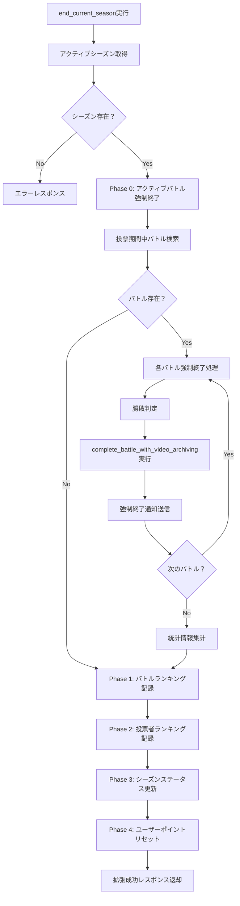
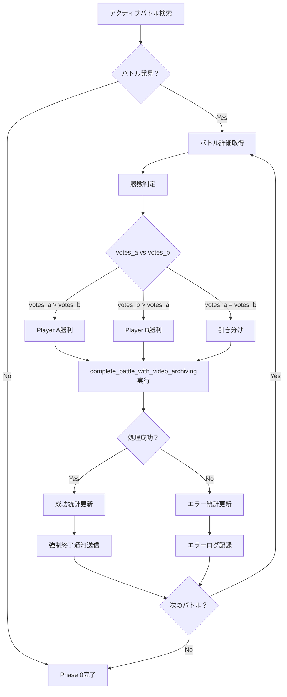

# BeatNexus シーズン終了時アクティブバトル強制終了機能仕様書

**最終更新**: 2025年7月28日  
**バージョン**: v1.0  
**適用環境**: 開発環境・本番環境

## 📋 目次
1. [概要](#概要)
2. [現状の課題と解決策](#現状の課題と解決策)
3. [機能要件](#機能要件)
4. [技術仕様](#技術仕様)
5. [修正対象関数詳細](#修正対象関数詳細)
6. [処理フロー](#処理フロー)
7. [エラーハンドリング](#エラーハンドリング)
8. [テスト仕様](#テスト仕様)
9. [リスク評価と対策](#リスク評価と対策)

---

## 概要

### 背景
現在のBeatNexusシステムでは、シーズン終了5日前からバトル投稿を停止することで、シーズンオフ期間中にバトル結果が確定することを防いでいます。しかし、この5日間の機能停止はプラットフォームの中核機能を長期間利用不可にするため、ユーザーエクスペリエンスの観点で改善が必要です。

### 解決方針
シーズン終了時に、まだ投票期間中のすべてのアクティブバトルを強制的に終了し、その時点での投票数で勝敗を決定する機能を`end_current_season()`関数に追加します。これにより、バトル投稿停止期間を短縮または撤廃できます。

### 主要な改善点
- **投稿停止期間の短縮**: 5日間 → 0〜1日間（管理者の裁量による）
- **自動処理**: 手動でのバトル処理が不要
- **データ整合性保証**: シーズン終了時点での完全なデータ確定
- **通知システム連携**: 強制終了したバトルの結果通知

---

## 現状の課題と解決策

### 現状の課題

#### 1. **長期間の機能停止**
```
問題: シーズン終了5日前からバトル投稿が完全停止
影響: プラットフォームの中核機能が長期間利用不可
結果: ユーザーエンゲージメントの低下
```

#### 2. **シーズンオフ中のバトル結果確定**
```
問題: 投票期間（5日間）がシーズン終了日を超えるバトルが存在
影響: シーズンランキングが確定後に変動する可能性
結果: ランキングの信頼性低下
```

#### 3. **管理負荷**
```
問題: 手動でのバトル処理が必要
影響: 管理者の作業負荷増加
結果: 運用コストの増大
```

### 解決策

#### 1. **アクティブバトル強制終了機能**
```sql
-- シーズン終了時に全アクティブバトルを強制終了
-- その時点での投票数で勝敗を決定
-- 完全自動化による運用負荷削減
```

#### 2. **投稿停止期間の柔軟化**
```
旧: 5日間の固定停止期間
新: 1日間の固定停止期間
```

#### 3. **データ整合性の確保**
```
- シーズン終了時点でのスナップショット取得
- 強制終了バトルも含めた完全なランキング確定
- アーカイブデータの整合性保証
```

---

## 機能要件

### 基本要件

#### FR-1: アクティブバトル検出
- **要件**: シーズン終了時点で投票期間中のすべてのアクティブバトルを検出
- **条件**: `status = 'ACTIVE'` かつ `end_voting_at > NOW()`
- **対象外**: 既に期限切れのバトル（`process_expired_battles`で処理済み）

#### FR-2: 強制終了処理
- **要件**: 検出されたアクティブバトルを現時点の投票数で強制終了
- **処理内容**:
  - 勝敗判定（投票数A vs 投票数B）
  - `complete_battle_with_video_archiving()`関数による完全なアーカイブ処理
  - レーティング・シーズンポイント更新
  - 通知送信（強制終了の旨を明記）

#### FR-3: 統計情報記録
- **要件**: 強制終了したバトルの統計情報を記録
- **記録内容**:
  - 強制終了バトル数
  - 勝敗内訳（Player A勝利/Player B勝利/引き分け）
  - エラー発生件数
  - 処理時間

#### FR-4: 既存機能の保持
- **要件**: 現在の`end_current_season()`機能を完全に保持
- **保持機能**:
  - プレイヤーランキングのスナップショット保存
  - 投票者ランキングのスナップショット保存
  - シーズンステータス更新
  - 全ユーザーのシーズンポイントリセット

### 非機能要件

#### NFR-1: パフォーマンス
- **要件**: 1,000件のアクティブバトルを30秒以内で処理
- **最適化**: バッチ処理とトランザクション管理の最適化

#### NFR-2: 可用性
- **要件**: 処理中のシステム停止を最小限に抑制
- **対策**: 段階的処理とロールバック機能

#### NFR-3: データ整合性
- **要件**: すべての関連データの整合性を保証
- **対策**: トランザクション境界の適切な設定

---

## 技術仕様

### 修正対象関数

#### 関数名: `end_current_season()`
- **場所**: `public`スキーマ
- **実行権限**: `SECURITY DEFINER`
- **戻り値**: `JSON`

### 新規処理フェーズ

#### Phase 0: アクティブバトル強制終了（新規追加）
```sql
-- 1. アクティブバトル検出
-- 2. 各バトルの強制終了処理
-- 3. 統計情報収集
-- 4. エラーハンドリング
```

#### Phase 1-4: 既存処理（変更なし）
```sql
-- Phase 1: バトルランキングスナップショット
-- Phase 2: 投票者ランキングスナップショット  
-- Phase 3: シーズンステータス更新
-- Phase 4: ユーザーポイントリセット
```

### 参考関数の活用

#### `process_expired_battles()`からの流用
- **バトル検出ロジック**: アクティブバトルの検索パターン
- **エラーハンドリング**: 例外処理とロールバック機構
- **統計情報収集**: 処理結果のJSON形式での記録

#### `complete_battle_with_video_archiving()`の活用
- **完全なバトル終了処理**: アーカイブ・レーティング更新・通知送信
- **削除ユーザー対応**: 削除されたユーザーとの対戦処理
- **動画URL保存**: 永続的なデータ保全

---

## 修正対象関数詳細

### 現在の`end_current_season()`関数構造

```sql
-- 現在の処理フロー
1. アクティブシーズン取得
2. バトルランキング記録 (season_rankings)
3. 投票者ランキング記録 (season_voter_rankings)
4. シーズンステータス更新 (status = 'ended')
5. ユーザーポイントリセット
6. 成功レスポンス返却
```

### 修正後の処理フロー

```sql
-- 修正後の処理フロー
0. 【新規】アクティブバトル強制終了処理
1. バトルランキング記録 (season_rankings) ← 既存
2. 投票者ランキング記録 (season_voter_rankings) ← 既存
3. シーズンステータス更新 (status = 'ended') ← 既存
4. ユーザーポイントリセット ← 既存
5. 拡張された成功レスポンス返却 ← 修正
```

### 新規追加部分の詳細設計

#### Phase 0: アクティブバトル強制終了処理

```sql
DECLARE
  -- 既存変数
  v_current_season RECORD;
  v_player_ranking_count INTEGER := 0;
  v_voter_ranking_count INTEGER := 0;
  
  -- 新規追加変数（強制終了処理用）
  v_active_battle RECORD;
  v_winner_id UUID;
  v_force_end_result JSON;
  v_forced_battles_count INTEGER := 0;
  v_forced_battles_errors INTEGER := 0;
  v_forced_battles_details JSON[] := ARRAY[]::JSON[];
  v_forced_battles_errors_details JSON[] := ARRAY[]::JSON[];
BEGIN
  -- 既存のシーズン取得処理...
  
  -- 【新規】Phase 0: アクティブバトル強制終了
  FOR v_active_battle IN
    SELECT 
      id, 
      player1_user_id, 
      player2_user_id, 
      votes_a, 
      votes_b,
      battle_format,
      end_voting_at
    FROM public.active_battles
    WHERE status = 'ACTIVE' 
      AND end_voting_at > NOW()  -- まだ投票期間中
    ORDER BY created_at ASC  -- 古いバトルから処理
  LOOP
    BEGIN
      -- 勝敗判定（process_expired_battlesと同じロジック）
      IF v_active_battle.votes_a > v_active_battle.votes_b THEN
        v_winner_id := v_active_battle.player1_user_id;
      ELSIF v_active_battle.votes_b > v_active_battle.votes_a THEN
        v_winner_id := v_active_battle.player2_user_id;
      ELSE
        v_winner_id := NULL; -- 引き分け
      END IF;

      -- バトル完了処理（complete_battle_with_video_archivingを使用）
      SELECT complete_battle_with_video_archiving(
        v_active_battle.id, 
        v_winner_id
      ) INTO v_force_end_result;

      -- 成功カウント・詳細記録
      v_forced_battles_count := v_forced_battles_count + 1;
      v_forced_battles_details := v_forced_battles_details || json_build_object(
        'battle_id', v_active_battle.id,
        'winner_id', v_winner_id,
        'votes_a', v_active_battle.votes_a,
        'votes_b', v_active_battle.votes_b,
        'original_end_time', v_active_battle.end_voting_at,
        'forced_end_time', NOW(),
        'completion_result', v_force_end_result
      );

      -- 強制終了通知の追加送信
      -- ※ complete_battle_with_video_archivingで基本通知は送信済み
      -- ここでは「シーズン終了による強制終了」の追記通知を送信

    EXCEPTION WHEN OTHERS THEN
      -- エラー時の処理
      v_forced_battles_errors := v_forced_battles_errors + 1;
      v_forced_battles_errors_details := v_forced_battles_errors_details || json_build_object(
        'battle_id', v_active_battle.id,
        'error_message', SQLERRM,
        'error_time', NOW(),
        'battle_details', json_build_object(
          'votes_a', v_active_battle.votes_a,
          'votes_b', v_active_battle.votes_b,
          'end_voting_at', v_active_battle.end_voting_at
        )
      );
      
      -- エラーログ出力
      RAISE NOTICE 'Error force-ending battle % during season end: %', 
        v_active_battle.id, SQLERRM;
    END;
  END LOOP;

  -- 既存のPhase 1-4処理...
  
  -- 拡張された成功レスポンス
  RETURN json_build_object(
    'success', true,
    'forced_battles', json_build_object(
      'processed_count', v_forced_battles_count,
      'error_count', v_forced_battles_errors,
      'details', v_forced_battles_details,
      'errors', v_forced_battles_errors_details
    ),
    'ended_season', json_build_object(
      'id', v_current_season.id,
      'name', v_current_season.name,
      'player_rankings_saved', v_player_ranking_count,
      'voter_rankings_saved', v_voter_ranking_count,
      'ended_at', NOW()
    ),
    'message', FORMAT(
      'シーズンが正常に終了しました。アクティブバトル%s件を強制終了しました。新しいシーズンを開始するには start_new_season() 関数を実行してください。',
      v_forced_battles_count
    )
  );
```

---

## 処理フロー

### 全体フロー図



### 詳細処理フロー

#### Phase 0: アクティブバトル強制終了



---

## エラーハンドリング

### エラー分類と対処法

#### 1. バトル処理エラー
```sql
-- エラー例：complete_battle_with_video_archiving実行失敗
-- 対処法：エラーログ記録、統計カウント、処理継続
EXCEPTION WHEN OTHERS THEN
  v_forced_battles_errors := v_forced_battles_errors + 1;
  v_forced_battles_errors_details := v_forced_battles_errors_details || json_build_object(
    'battle_id', v_active_battle.id,
    'error_message', SQLERRM,
    'error_time', NOW()
  );
  -- 次のバトル処理に継続
```

#### 2. データ整合性エラー
```sql
-- エラー例：関連テーブルの外部キー制約違反
-- 対処法：トランザクション分離、部分的なロールバック
```

#### 3. システムリソースエラー
```sql
-- エラー例：メモリ不足、ディスク容量不足
-- 対処法：処理の分割、リソース監視
```

### エラー回復戦略

#### 1. 部分的成功
- **方針**: 一部のバトル処理が失敗しても、成功したバトルの結果は保持
- **実装**: 各バトルを独立したトランザクションで処理

#### 2. 統計情報の完全性
- **方針**: エラーが発生しても統計情報は正確に記録
- **実装**: エラーカウントとエラー詳細の別管理

#### 3. 既存機能への影響排除
- **方針**: 新機能のエラーが既存のシーズン終了処理に影響しない
- **実装**: Phase 0エラーでもPhase 1-4は継続実行

---

## テスト仕様

### テストケース設計

#### TC-1: 正常系テスト

##### TC-1-1: アクティブバトルなしでのシーズン終了
```sql
-- 前提条件
- アクティブシーズンが存在
- 投票期間中のアクティブバトルが0件

-- 期待結果
- forced_battles.processed_count = 0
- forced_battles.error_count = 0
- 既存機能（ランキング保存等）は正常動作
```

##### TC-1-2: 少数アクティブバトルでのシーズン終了
```sql
-- 前提条件
- アクティブシーズンが存在
- 投票期間中のアクティブバトルが3件
- 各バトルは正常な状態

-- 期待結果
- forced_battles.processed_count = 3
- forced_battles.error_count = 0
- 全バトルがarchived_battlesに移行
- プレイヤーのレーティング・シーズンポイントが更新
- 通知が適切に送信
```

##### TC-1-3: 多数アクティブバトルでのシーズン終了
```sql
-- 前提条件
- アクティブシーズンが存在
- 投票期間中のアクティブバトルが100件

-- 期待結果
- forced_battles.processed_count = 100
- forced_battles.error_count = 0
- 処理時間が許容範囲内（30秒以内）
```

#### TC-2: 異常系テスト

##### TC-2-1: 一部バトル処理失敗
```sql
-- 前提条件
- アクティブシーズンが存在
- 投票期間中のアクティブバトルが5件
- うち1件のsubmissionが削除済み（データ不整合）

-- 期待結果
- forced_battles.processed_count = 4
- forced_battles.error_count = 1
- エラー詳細がerrors配列に記録
- 成功したバトルは正常に処理完了
- 既存機能は正常動作
```

##### TC-2-2: システムリソース不足
```sql
-- 前提条件
- アクティブシーズンが存在
- 投票期間中のアクティブバトルが1000件
- システムメモリが制限される環境

-- 期待結果
- 部分的な処理成功
- 適切なエラーログ記録
- システム停止の回避
```

#### TC-3: 境界値テスト

##### TC-3-1: 投票数が同じバトル（引き分け）
```sql
-- 前提条件
- votes_a = votes_b = 5のバトル

-- 期待結果
- winner_id = NULL
- 引き分け通知の送信
- レーティング計算（引き分け処理）
```

##### TC-3-2: 投票数0のバトル
```sql
-- 前提条件
- votes_a = votes_b = 0のバトル

-- 期待結果
- winner_id = NULL（引き分け扱い）
- 正常処理完了
```

##### TC-3-3: 削除ユーザーとのバトル
```sql
-- 前提条件
- player1が削除済み、player2がアクティブ

-- 期待結果
- 削除ユーザー対応ロジックの適用
- レーティング更新（削除ユーザー分は更新しない）
- 通知はアクティブユーザーのみに送信
```

### パフォーマンステスト

#### PT-1: 大量データ処理テスト
```sql
-- テストデータ準備
- 1,000件のアクティブバトル作成
- 各バトルに平均10件の投票を付与

-- 測定項目
- 総処理時間
- メモリ使用量
- CPU使用率
- データベース接続数

-- 成功条件
- 処理時間 < 30秒
- メモリ使用量 < 1GB
- エラー率 < 1%
```

---

## リスク評価と対策

### 高リスク項目

#### R-1: 大量バトル処理によるシステム負荷
- **リスクレベル**: 高
- **影響**: システム停止、処理失敗
- **対策**: 
  - バッチサイズ制限（50件ずつ処理）
  - 処理間隔の設定（0.1秒待機）
  - リソース監視とアラート

#### R-2: 部分的処理失敗によるデータ不整合
- **リスクレベル**: 中
- **影響**: ランキング不正確、ユーザー混乱
- **対策**:
  - 独立トランザクション設計
  - 詳細エラーログ記録
  - 手動修正プロセスの準備

#### R-3: 通知大量送信によるシステム負荷
- **リスクレベル**: 中
- **影響**: 通知システムの停止
- **対策**:
  - 通知送信の分散化
  - 通知キューシステムの活用
  - 送信失敗時のリトライ機構

### 中リスク項目

#### R-4: 既存機能への影響
- **リスクレベル**: 中
- **影響**: 従来のシーズン終了処理失敗
- **対策**:
  - 新機能のエラー分離
  - 既存処理の優先実行
  - ロールバック戦略の明確化

#### R-5: ユーザー体験の悪化
- **リスクレベル**: 中
- **影響**: ユーザーの混乱、不満
- **対策**:
  - 明確な事前告知
  - 適切な通知メッセージ
  - FAQ・ヘルプの準備

### 低リスク項目

#### R-6: 処理統計の不正確さ
- **リスクレベル**: 低
- **影響**: 運用データの不正確さ
- **対策**:
  - 統計情報の検証ロジック
  - ログベースでの再集計機能

---

## 実装計画

### Phase 1: 開発環境での実装（Week 1）
1. **関数修正**: `end_current_season()`の拡張実装
2. **単体テスト**: 各テストケースの実行
3. **統合テスト**: 既存機能との整合性確認

### Phase 2: 包括的テスト（Week 2）
1. **パフォーマンステスト**: 大量データでの性能測定
2. **ストレステスト**: システム負荷時の動作確認  
3. **回帰テスト**: 既存機能への影響確認

### Phase 3: 本番環境適用準備（Week 3）
1. **本番データバックアップ**: 完全なデータバックアップ取得
2. **ロールバック計画**: 緊急時の復旧手順確立
3. **監視体制**: 処理状況の監視システム準備

### Phase 4: 本番環境適用（Week 4）
1. **段階的適用**: 低負荷時間帯での適用
2. **リアルタイム監視**: 処理状況の常時監視
3. **即座対応**: 問題発生時の迅速対応

---

## 運用・保守

### 監視項目
- **処理時間**: シーズン終了処理の所要時間
- **エラー率**: 強制終了バトルの処理失敗率  
- **リソース使用量**: CPU、メモリ、ディスクの使用状況
- **通知送信状況**: ユーザー通知の送信成功率

### 定期メンテナンス
- **統計データ分析**: 強制終了バトルの傾向分析
- **パフォーマンス最適化**: 処理効率の継続的改善
- **エラーログ分析**: 頻発エラーの根本原因調査

### ユーザーサポート
- **FAQ更新**: 強制終了機能に関する説明追加
- **問い合わせ対応**: ユーザーからの質問への適切な回答
- **透明性確保**: 処理結果の公開と説明

---

## 結論

本仕様書で定義したシーズン終了時アクティブバトル強制終了機能により、以下の改善が期待されます：

### 主要改善点
1. **ユーザーエクスペリエンス向上**: バトル投稿停止期間の大幅短縮
2. **運用効率化**: 手動処理の完全自動化
3. **データ整合性強化**: シーズン終了時点での完全なデータ確定
4. **システム安定性**: 堅牢なエラーハンドリングによる安定運用

### 次のステップ
1. 開発環境での詳細実装
2. 包括的テストの実行
3. 本番環境への段階的適用
4. 継続的な監視と改善

---

## 関連ドキュメント
- [バトル終了・結果集計・レーティング計算システム仕様書](./バトル終了・結果集計・レーティング計算システム仕様書.md)
- [シーズンシステム仕様書](./シーズンシステム仕様書.md)
- [BeatNexus.md](./BeatNexus.md) - プロジェクト全体仕様

---

**注意**: この仕様書に基づいて実装を進める前に、必ず開発環境での十分なテストを実施し、関係者のレビューと承認を得てください。
