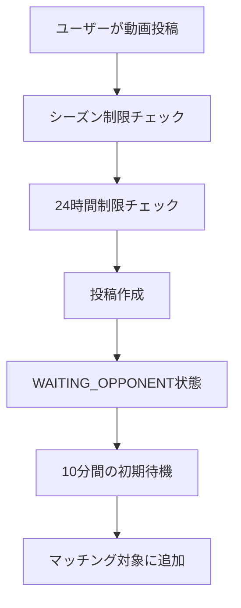

# BeatNexus マッチング・投稿機能仕様書

**最終更新**: 2025年7月23日  
**バージョン**: v5 (理想的な時間ベース段階的マッチング)  
**適用環境**: 開発環境・本番環境

## 📋 目次
1. [概要](#概要)
2. [投稿システム](#投稿システム)
3. [マッチングシステム](#マッチングシステム)
4. [時間ベース段階的マッチング](#時間ベース段階的マッチング)
5. [自動処理スケジュール](#自動処理スケジュール)
6. [具体的なマッチング例](#具体的なマッチング例)
7. [関数詳細解説](#関数詳細解説)
8. [制限事項・セキュリティ](#制限事項セキュリティ)

---

## 概要

BeatNexusのマッチング・投稿システムは、ビートボクサーが動画を投稿し、適切な相手と自動的にマッチングされてバトルが開始される機能です。レーティングベースの段階的マッチングにより、公平で競争力のあるバトルを実現します。

### 主要な特徴
- **24時間投稿制限**: 1日1回の投稿制限
- **シーズン制限**: シーズン状況による投稿制御
- **時間ベース段階的マッチング**: 待機時間に応じて許容レート差が拡大
- **自動処理**: 30分間隔でのマッチメイキング実行

---

## 投稿システム

### データフロー



### 投稿制限システム

#### 1. シーズン制限
```sql
SELECT can_submit_video() -- シーズン状況による投稿可否判定
```

#### 2. 24時間制限（クールダウン）
- **制限**: 24時間以内に1回の投稿のみ
- **対象**: 同一ユーザーの新規投稿
- **例外**: `withdrawn`（取り下げ）された投稿は除外

#### 3. 投稿ステータス
| ステータス | 説明 | 次の処理 |
|------------|------|----------|
| `WAITING_OPPONENT` | 対戦相手待ち | マッチング対象 |
| `MATCHED_IN_BATTLE` | バトル中 | 投票期間 |
| `withdrawn` | 取り下げ | なし |

---

## マッチングシステム

### 基本原理

#### マッチング条件
1. **同じバトルフォーマット**: `battle_format`が一致
2. **異なるユーザー**: 自分自身とはマッチしない
3. **初期待機期間経過**: 投稿から10分経過
4. **レート差制限**: 時間に応じた許容レート差内

#### マッチング優先順位
1. **レート差の小ささ**: より近いレーティングを優先
2. **投稿時間の早さ**: より長く待機している投稿を優先

---

## 時間ベース段階的マッチング

### 🎯 理想的な許容レート差システム

| 待機時間 | 許容レート差 | 設計思想 |
|----------|-------------|----------|
| **0-6時間** | ±50 | 新鮮な対戦はほぼ同格同士 |
| **6-24時間** | ±100 | 少し幅を持たせてマッチ確率UP |
| **24-72時間** | ±200 | 24時間以内にマッチできなかったら緩和 |
| **72-168時間** | ±300 | 3日-7日経過でさらに緩和 |
| **168時間以降** | **無制限** | どうしても当たらない場合は全体からマッチ |

### アルゴリズムの実装
```sql
-- 待機時間に基づく許容レート差の決定
IF v_waiting_hours < 6 THEN
  v_rating_tolerance := 50;
ELSIF v_waiting_hours < 24 THEN
  v_rating_tolerance := 100;
ELSIF v_waiting_hours < 72 THEN
  v_rating_tolerance := 200;
ELSIF v_waiting_hours < 168 THEN
  v_rating_tolerance := 300;
ELSE
  v_rating_tolerance := 999999; -- 無制限
END IF;
```

---

## 自動処理スケジュール

### pg_cronによる定期実行

#### 1. マッチメイキング処理
- **実行間隔**: 30分ごと
- **関数**: `progressive_matchmaking()`
- **処理内容**: 待機中の投稿をマッチング

#### 2. バトル終了処理
- **実行間隔**: 5分ごと
- **関数**: `process_expired_battles()`
- **処理内容**: 投票期間終了したバトルの判定

#### 3. その他の定期処理
- **シーズン終了処理**: 毎時実行
- **メールアドレス解放**: 毎日午前2時

---

## 具体的なマッチング例

### 例1: レート1200のプレイヤーAが投稿

#### タイムライン
```
00:00 - プレイヤーA (レート1200) が動画投稿
00:10 - 初期待機期間終了、マッチング対象に
00:30 - 1回目のマッチング処理実行
        → レート1150-1250の相手を検索
        → 該当者なし、待機継続

06:30 - 6時間後のマッチング処理
        → レート1100-1300の相手を検索（±100）
        → プレイヤーB (レート1180) を発見
        → マッチング成立！
```

#### マッチング結果
- **対戦相手**: プレイヤーB (レート1180)
- **レート差**: 20
- **待機時間**: 6.5時間
- **投票期間**: 5日間

### 例2: レート800の初心者プレイヤーCが投稿

#### タイムライン
```
月曜 00:00 - プレイヤーC (レート800) 投稿
月曜 06:00 - レート750-850で検索 → マッチなし
火曜 00:00 - レート700-900で検索 → マッチなし
水曜 00:00 - レート600-1000で検索 → マッチなし
木曜 00:00 - レート500-1100で検索 → マッチなし
金曜 00:00 - 無制限で検索 → プレイヤーD (レート1100) とマッチ
```

#### マッチング結果
- **対戦相手**: プレイヤーD (レート1100)
- **レート差**: 300
- **待機時間**: 120時間（5日）
- **投票期間**: 5日間

---

## 関数詳細解説

### 1. `create_submission_with_cooldown_check()`

#### 目的
動画投稿の制限チェックと新規投稿作成

#### パラメータ
- `p_user_id`: 投稿者のユーザーID
- `p_video_url`: 動画URL
- `p_battle_format`: バトルフォーマット

#### 処理フロー
```sql
1. シーズン制限チェック (can_submit_video())
2. 24時間制限チェック
3. 投稿データ作成 (status = 'WAITING_OPPONENT')
4. 結果返却
```

#### 戻り値例（成功）
```json
{
  "success": true,
  "submission_id": "uuid",
  "message": "投稿が正常に作成されました。"
}
```

#### 戻り値例（24時間制限）
```json
{
  "success": false,
  "error": "cooldown_active",
  "message": "24時間以内に投稿できるのは1本までです。次回投稿可能まで: 18時間42分",
  "remaining_seconds": 67320
}
```

### 2. `progressive_matchmaking()`

#### 目的
時間ベース段階的マッチング処理

#### 処理フロー
```sql
1. WAITING_OPPONENT状態の投稿を取得（10分待機済み）
2. 各投稿の待機時間を計算
3. 待機時間に基づく許容レート差を決定
4. 条件に合致する対戦相手を検索
5. マッチした場合、active_battlesにバトル作成
6. 両投稿のステータスをMATCHED_IN_BATTLEに更新
```

#### 対戦相手検索条件
```sql
WHERE s2.status = 'WAITING_OPPONENT'
  AND s2.id != v_submission_rec.id              -- 自分自身を除外
  AND s2.user_id != v_submission_rec.user_id    -- 同一ユーザーを除外
  AND s2.battle_format = v_submission_rec.battle_format  -- 同じフォーマット
  AND s2.created_at + INTERVAL '10 minutes' <= NOW()     -- 相手も10分待機済み
  AND ABS(p2.rating - v_submitter_rating) <= v_rating_tolerance  -- レート差制限
ORDER BY ABS(p2.rating - v_submitter_rating) ASC, s2.created_at ASC  -- 優先順位
```

#### 戻り値例
```json
{
  "processed_submissions": 5,
  "matches_created": 2,
  "results": [
    {
      "submission_id": "uuid1",
      "opponent_id": "uuid2",
      "battle_id": "uuid3",
      "submitter_rating": 1200,
      "opponent_rating": 1180,
      "rating_difference": 20,
      "waiting_hours": 6.5,
      "rating_tolerance_used": 100,
      "matched": true,
      "match_type": "progressive_ideal_time_based"
    }
  ],
  "rating_tolerance_schedule": {
    "0_to_6_hours": 50,
    "6_to_24_hours": 100,
    "24_to_72_hours": 200,
    "72_to_168_hours": 300,
    "168_hours_plus": "unlimited"
  }
}
```

---

## 制限事項・セキュリティ

### 投稿制限
1. **認証必須**: ログインユーザーのみ投稿可能
2. **24時間制限**: 1日1回の投稿制限
3. **シーズン制限**: シーズン状況による制御
4. **重複投稿防止**: 同時に複数の投稿を持てない

### マッチング制限
1. **最低待機時間**: 10分間の初期待機必須
2. **同一ユーザー除外**: 自分自身とはマッチしない
3. **フォーマット一致**: 同じbattle_formatのみマッチ
4. **公平性確保**: レーティングベースの段階的マッチング

### セキュリティ
```sql
SECURITY DEFINER  -- 関数実行者の権限で実行
GRANT EXECUTE TO authenticated;  -- 認証ユーザーのみ実行可能
```

---

## パフォーマンス最適化

### インデックス設計
```sql
-- 効率的なマッチング検索のためのインデックス
CREATE INDEX idx_submissions_waiting_matchmaking ON submissions(status, battle_format, created_at)
WHERE status = 'WAITING_OPPONENT';

CREATE INDEX idx_submissions_user_cooldown ON submissions(user_id, created_at)
WHERE created_at > NOW() - INTERVAL '24 hours';
```

### バッチ処理
- **マッチング**: 30分間隔で一括処理
- **バトル終了**: 5分間隔で一括処理
- **効率的な検索**: インデックスを活用した高速クエリ

---

## 今後の改善予定

### 検討中の機能
1. **優先マッチング**: プレミアムユーザー向け高速マッチング
2. **地域別マッチング**: タイムゾーンを考慮したマッチング
3. **スキル別カテゴリ**: ジャンル特化型マッチング
4. **トーナメントモード**: 複数人参加の大会形式

---

## 関連ドキュメント
- [投票機能仕様書](./投票機能仕様書.md)
- [シーズンシステム仕様書](./シーズンシステム仕様書.md)
- [BeatNexus.mdc](./BeatNexus.mdc) - プロジェクト全体仕様

---

**注意**: この仕様書は実装済みの機能を詳細に解説したものです。次回のテストで動作確認を行います。
