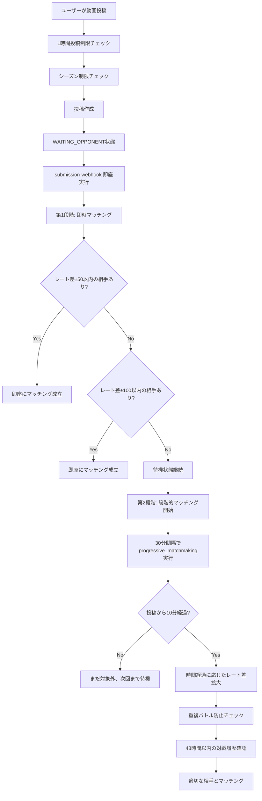
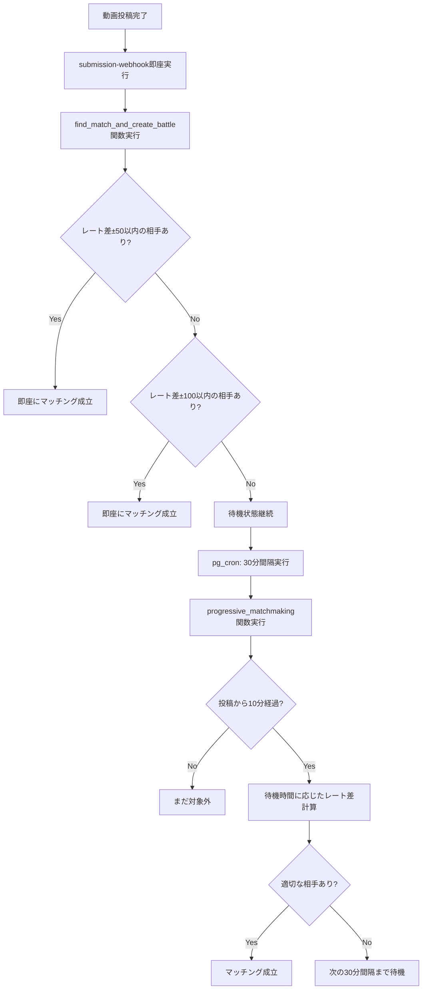

# BeatNexus マッチング・投稿機能仕様書

**最終更新**: 2025年7月25日  
**バージョン**: v7 (重複バトル防止システム実装)  
**適用環境**: 開発環境・本番環境

## 📋 目次
1. [概要](#概要)
2. [投稿システム](#投稿システム)
3. [マッチングシステム](#マッチングシステム)
4. [時間ベース段階的マッチング](#時間ベース段階的マッチング)
5. [自動処理スケジュール](#自動処理スケジュール)
6. [具体的なマッチング例](#具体的なマッチング例)
7. [関数詳細解説](#関数詳細解説)
8. [制限事項・セキュリティ](#制限事項セキュリティ)

---

## 概要

BeatNexusのマッチング・投稿システムは、ビートボクサーが動画を投稿し、適切な相手と自動的にマッチングされてバトルが開始される機能です。レーティングベースの段階的マッチングにより、公平で競争力のあるバトルを実現します。

### 主要な特徴
- **1時間投稿制限**: 1時間に1回の投稿制限（サーバー負荷・ディスク容量抑制）
- **重複バトル防止**: 48時間以内の同じ相手との再マッチを防止
- **シーズン制限**: シーズン状況による投稿制御
- **時間ベース段階的マッチング**: 待機時間に応じて許容レート差が拡大
- **自動処理**: 30分間隔でのマッチメイキング実行

---

## 投稿システム

### データフロー



### 投稿制限システム

#### 1. 1時間投稿制限
```sql
-- 1時間以内の投稿履歴チェック
SELECT created_at FROM submissions
WHERE user_id = p_user_id
  AND created_at > NOW() - INTERVAL '1 hour'
  AND status != 'withdrawn'
ORDER BY created_at DESC
LIMIT 1;
```

**目的**: 
- **サーバー負荷軽減**: 大量投稿による処理負荷の抑制
- **ディスク容量保護**: 動画ファイルによるストレージ使用量制御
- **システム安定性**: リソース消費の平準化

#### 2. シーズン制限
```sql
SELECT can_submit_video() -- シーズン状況による投稿可否判定
```

#### 3. 重複バトル防止システム
- **制限**: 48時間以内に同じ相手との再マッチを防止
- **対象**: active_battlesとarchived_battlesの両方から履歴チェック
- **効果**: より多様な対戦相手との遭遇機会を提供

#### 4. 投稿ステータス
| ステータス | 説明 | 次の処理 |
|------------|------|----------|
| `WAITING_OPPONENT` | 対戦相手待ち | マッチング対象 |
| `MATCHED_IN_BATTLE` | バトル中 | 投票期間 |
| `withdrawn` | 取り下げ | なし |

---

## マッチングシステム

### 基本原理

BeatNexusのマッチングシステムは**二段階マッチング**方式を採用しています。

#### **第1段階: 即時マッチング**
- **実行タイミング**: 投稿直後（数秒以内）
- **実行関数**: `find_match_and_create_battle()`
- **呼び出し元**: submission-webhook Edge Function
- **待機時間**: なし（即座実行）
- **レート差制限**: ±50 → ±100（固定2段階）

#### **第2段階: 段階的マッチング**
- **実行タイミング**: 30分間隔（pg_cron）
- **実行関数**: `progressive_matchmaking()`
- **対象条件**: 投稿から10分経過済み
- **レート差制限**: 時間経過に応じて段階的拡大

### マッチング条件

#### 即時マッチング条件
1. **同じバトルフォーマット**: `battle_format`が一致
2. **異なるユーザー**: 自分自身とはマッチしない
3. **初期待機期間**: なし（即座実行）
4. **レート差制限**: ±50 → ±100（2段階固定）
5. **重複バトル防止**: 基本的な重複チェック

#### 段階的マッチング条件
1. **同じバトルフォーマット**: `battle_format`が一致
2. **異なるユーザー**: 自分自身とはマッチしない
3. **初期待機期間経過**: 投稿から10分経過
4. **レート差制限**: 時間に応じた許容レート差内
5. **🛡️ 重複バトル防止**: 48時間以内の同じ相手との対戦履歴がない

#### マッチング優先順位
1. **レート差の小ささ**: より近いレーティングを優先
2. **投稿時間の早さ**: より長く待機している投稿を優先

---

## 時間ベース段階的マッチング

### 🎯 二段階マッチングシステム

#### **第1段階: 即時マッチング**
| レート差制限 | 実行タイミング | 設計思想 |
|-------------|-------------|----------|
| **±50** | 投稿直後（第1優先） | 最も近いレート同士の即座マッチング |
| **±100** | 投稿直後（第2優先） | やや広い範囲での即座マッチング |

#### **第2段階: 段階的マッチング（progressive_matchmaking）**
| 待機時間 | 許容レート差 | 設計思想 |
|----------|-------------|----------|
| **0-6時間** | ±50 | 新鮮な対戦はほぼ同格同士 |
| **6-24時間** | ±100 | 少し幅を持たせてマッチ確率UP |
| **24-72時間** | ±200 | 24時間以内にマッチできなかったら緩和 |
| **72-168時間** | ±300 | 3日-7日経過でさらに緩和 |
| **168時間以降** | **無制限** | どうしても当たらない場合は全体からマッチ |

### 実際のマッチング動作フロー



### アルゴリズムの実装

#### 即時マッチング（find_match_and_create_battle）
```sql
-- 第1優先: レート差±50以内で検索
SELECT s.* FROM submissions s
JOIN profiles p ON s.user_id = p.id
WHERE s.battle_format = v_submission.battle_format
  AND s.status = 'WAITING_OPPONENT'
  AND s.user_id != v_submission.user_id
  AND ABS(p.rating - v_submitter_rating) <= 50
ORDER BY ABS(p.rating - v_submitter_rating) ASC, s.created_at ASC
LIMIT 1;

-- 第2優先: レート差±100以内で検索（±50で見つからなかった場合）
-- 同様の条件でレート差制限を100に変更
```

#### 段階的マッチング（progressive_matchmaking）
```sql
-- 待機時間に基づく許容レート差の決定
IF v_waiting_hours < 6 THEN
  v_rating_tolerance := 50;
ELSIF v_waiting_hours < 24 THEN
  v_rating_tolerance := 100;
ELSIF v_waiting_hours < 72 THEN
  v_rating_tolerance := 200;
ELSIF v_waiting_hours < 168 THEN
  v_rating_tolerance := 300;
ELSE
  v_rating_tolerance := 999999; -- 無制限
END IF;
```

---

## 自動処理スケジュール

### pg_cronによる定期実行

#### 1. 即時マッチング処理
- **実行タイミング**: 投稿直後（submission-webhook）
- **関数**: `find_match_and_create_battle()`
- **処理内容**: 投稿直後の即座マッチング試行

#### 2. 段階的マッチング処理
- **実行間隔**: 30分ごと
- **関数**: `progressive_matchmaking()`
- **処理内容**: 10分以上待機中の投稿をマッチング

#### 2. バトル終了処理
- **実行間隔**: 5分ごと
- **関数**: `process_expired_battles()`
- **処理内容**: 投票期間終了したバトルの判定

#### 3. その他の定期処理
- **シーズン終了処理**: 毎時実行
- **メールアドレス解放**: 毎日午前2時

---

## 具体的なマッチング例

### 例1: レート1200のプレイヤーAが投稿（即時マッチング成功）

#### 前提条件
- プレイヤーB (レート1180) が既に待機中

#### タイムライン
```
00:00:00 - プレイヤーA (レート1200) が動画投稿
00:00:05 - submission-webhook実行
         → find_match_and_create_battle実行
         → レート差±50(1150-1250)で検索 → プレイヤーB発見（差20）
         → 即座にマッチング成立！
```

#### マッチング結果
- **対戦相手**: プレイヤーB (レート1180)
- **レート差**: 20
- **待機時間**: 5秒
- **マッチング方式**: 即時マッチング（第1段階）
- **投票期間**: 5日間

### 例2: レート1200のプレイヤーAが投稿（段階的マッチング）

#### 前提条件
- 近いレートの待機相手がいない状況

#### タイムライン
```
00:00:00 - プレイヤーA (レート1200) が動画投稿
00:00:05 - submission-webhook実行
         → find_match_and_create_battle実行
         → レート差±50(1150-1250)で検索 → 該当者なし
         → レート差±100(1100-1300)で検索 → 該当者なし
         → 待機状態継続

00:30:00 - pg_cron: progressive_matchmaking実行
         → 投稿から30分経過、10分条件クリア
         → 待機時間0.5時間 → レート差±50で検索
         → 該当者なし → 待機継続

06:30:00 - pg_cron: progressive_matchmaking実行
         → 待機時間6.5時間 → レート差±100で検索（6時間超で緩和）
         → プレイヤーC (レート1180) を発見
         → マッチング成立！
```

#### マッチング結果
- **対戦相手**: プレイヤーC (レート1180)
- **レート差**: 20
- **待機時間**: 6.5時間
- **マッチング方式**: 段階的マッチング（第2段階）
- **投票期間**: 5日間

### 例3: レート800の初心者プレイヤーDが投稿（長期待機パターン）

#### タイムライン
```
月曜 00:00:00 - プレイヤーD (レート800) 投稿
月曜 00:00:05 - 即時マッチング試行 → 該当者なし → 待機継続
月曜 00:10:01 - 段階的マッチング対象に追加
火曜 00:00:00 - レート700-900で検索 → マッチなし
水曜 00:00:00 - レート600-1000で検索 → マッチなし
木曜 00:00:00 - レート500-1100で検索 → マッチなし
金曜 00:00:00 - 無制限で検索 → プレイヤーE (レート1100) とマッチ
```

#### マッチング結果
- **対戦相手**: プレイヤーE (レート1100)
- **レート差**: 300
- **待機時間**: 120時間（5日）
- **マッチング方式**: 段階的マッチング（無制限段階）
- **投票期間**: 5日間

---

## 関数詳細解説

### 1. `create_submission_with_cooldown_check()`

#### 目的
動画投稿の制限チェックと新規投稿作成

#### パラメータ
- `p_user_id`: 投稿者のユーザーID
- `p_video_url`: 動画URL
- `p_battle_format`: バトルフォーマット

#### 処理フロー
```sql
1. 1時間投稿制限チェック
2. シーズン制限チェック (can_submit_video())
3. 投稿データ作成 (status = 'WAITING_OPPONENT')
4. 結果返却
```

#### 戻り値例（成功）
```json
{
  "success": true,
  "submission_id": "uuid",
  "message": "投稿が正常に作成されました。"
}
```

#### 戻り値例（1時間制限）
```json
{
  "success": false,
  "error": "cooldown_active",
  "message": "1時間以内に投稿できるのは1本までです。次回投稿可能まで: 42分",
  "remaining_seconds": 2520
}
```

### 2. `find_match_and_create_battle()`

#### 目的
投稿直後の即時マッチング処理（第1段階マッチング）

#### パラメータ
- `p_submission_id`: 投稿ID

#### 処理フロー
```sql
1. 投稿詳細の取得
2. 投稿者のレーティング・ユーザー名取得
3. 第1優先: レート差±50以内で対戦相手検索
4. 見つからない場合、第2優先: レート差±100以内で検索
5. マッチした場合、active_battlesにバトル作成
6. 両投稿のステータスをMATCHED_IN_BATTLEに更新
7. マッチング通知を両プレイヤーに送信
```

#### 対戦相手検索条件（第1優先）
```sql
WHERE s.battle_format = v_submission.battle_format
  AND s.status = 'WAITING_OPPONENT'
  AND s.user_id != v_submission.user_id
  AND s.id != p_submission_id
  AND ABS(p.rating - v_submitter_rating) <= 50  -- ±50レート制限
ORDER BY ABS(p.rating - v_submitter_rating) ASC, s.created_at ASC
```

#### 戻り値例（マッチング成功）
```json
{
  "battle_created": true,
  "battle_id": "uuid",
  "opponent_id": "uuid",
  "voting_ends_at": "2025-07-30T12:00:00Z",
  "message": "Battle created successfully with 5-day voting period",
  "notifications_sent": 2,
  "match_details": {
    "submitter_rating": 1200,
    "opponent_rating": 1180,
    "rating_difference": 20,
    "match_type": "immediate_edge_function",
    "voting_period_days": 5
  }
}
```

#### 戻り値例（マッチング失敗）
```json
{
  "battle_created": false,
  "message": "No suitable opponent found within rating range, submission waiting for progressive matching",
  "waiting": true,
  "submitter_rating": 1200,
  "max_rating_diff_tried": 100
}
```

### 3. `progressive_matchmaking()`

#### 目的
時間ベース段階的マッチング処理（第2段階マッチング）

#### 処理フロー
```sql
1. WAITING_OPPONENT状態の投稿を取得（10分待機済み）
2. 各投稿の待機時間を計算
3. 待機時間に基づく許容レート差を決定
4. 重複バトル防止チェック（48時間以内の対戦履歴確認）
5. 条件に合致する対戦相手を検索
6. マッチした場合、active_battlesにバトル作成
7. 両投稿のステータスをMATCHED_IN_BATTLEに更新
8. マッチング通知を両プレイヤーに送信
```

#### 対戦相手検索条件（重複バトル防止付き）
```sql
WHERE s2.status = 'WAITING_OPPONENT'
  AND s2.id != v_submission_rec.id              -- 自分自身を除外
  AND s2.user_id != v_submission_rec.user_id    -- 同一ユーザーを除外
  AND s2.battle_format = v_submission_rec.battle_format  -- 同じフォーマット
  AND s2.created_at + INTERVAL '10 minutes' <= NOW()     -- 相手も10分待機済み
  AND ABS(p2.rating - v_submitter_rating) <= v_rating_tolerance  -- レート差制限
  -- 🛡️ 重複バトル防止条件: 48時間以内に同じ相手との対戦履歴がないことを確認
  AND NOT EXISTS (
    SELECT 1 FROM public.active_battles ab
    JOIN public.submissions s1 ON (ab.player1_submission_id = s1.id OR ab.player2_submission_id = s1.id)
    JOIN public.submissions s3 ON (ab.player1_submission_id = s3.id OR ab.player2_submission_id = s3.id)
    WHERE ab.created_at >= NOW() - INTERVAL '48 hours'
      AND s1.user_id = v_submission_rec.user_id
      AND s3.user_id = s2.user_id
      AND s1.id != s3.id
  )
ORDER BY ABS(p2.rating - v_submitter_rating) ASC, s2.created_at ASC  -- 優先順位
```

#### 戻り値例
```json
{
  "processed_submissions": 5,
  "matches_created": 2,
  "results": [
    {
      "submission_id": "uuid1",
      "opponent_id": "uuid2",
      "battle_id": "uuid3",
      "submitter_rating": 1200,
      "opponent_rating": 1180,
      "rating_difference": 20,
      "waiting_hours": 6.5,
      "rating_tolerance_used": 100,
      "matched": true,
      "match_type": "progressive_with_duplicate_prevention",
      "voting_period_days": 5,
      "duplicate_prevention_active": true,
      "notifications_sent": 2
    }
  ],
  "timestamp": "2025-07-27T12:00:00Z",
  "function_version": "v7_with_duplicate_prevention_and_notifications",
  "execution_interval": "30_minutes",
  "initial_wait_period": "10_minutes",
  "duplicate_prevention_window": "48_hours",
  "rating_tolerance_schedule": {
    "0_to_6_hours": 50,
    "6_to_24_hours": 100,
    "24_to_72_hours": 200,
    "72_to_168_hours": 300,
    "168_hours_plus": "unlimited"
  }
}
```

### 4. submission-webhook Edge Function

#### 目的
投稿直後の即時マッチング処理を実行するWebhook

#### 呼び出し元
フロントエンド（PostPage.tsx）の投稿処理完了後

#### 処理フロー
```typescript
1. submission_idを受け取り
2. submissionsテーブルから投稿詳細を取得
3. find_match_and_create_battle()関数を実行
4. マッチング結果をフロントエンドに返却
```

#### 実行条件
- 投稿作成直後（create_submission_with_cooldown_check成功後）
- レスポンス速度重視（数秒以内）

#### 戻り値パターン
```typescript
// マッチング成功時
{
  success: true,
  message: "Battle created successfully!",
  battle_id: "uuid",
  matched_with: "uuid"
}

// マッチング失敗時（待機継続）
{
  success: true,
  message: "Submission is waiting for an opponent",
  waiting: true,
  submission_id: "uuid"
}
```

---

## 制限事項・セキュリティ

### 投稿制限
1. **認証必須**: ログインユーザーのみ投稿可能
2. **1時間制限**: 1時間に1回の投稿制限（サーバー負荷・ディスク容量抑制）
3. **シーズン制限**: シーズン状況による制御
4. **重複投稿防止**: 同時に複数の投稿を持てない

### マッチング制限
1. **最低待機時間**: 段階的マッチングは10分間の初期待機が必要（即時マッチングは対象外）
2. **同一ユーザー除外**: 自分自身とはマッチしない
3. **フォーマット一致**: 同じbattle_formatのみマッチ
4. **公平性確保**: レーティングベースの段階的マッチング
5. **重複バトル防止**: 段階的マッチングでは48時間以内の同一相手との対戦を防止

### セキュリティ
```sql
SECURITY DEFINER  -- 関数実行者の権限で実行
GRANT EXECUTE TO authenticated;  -- 認証ユーザーのみ実行可能
```

---

## パフォーマンス最適化

### インデックス設計
```sql
-- 効率的なマッチング検索のためのインデックス
CREATE INDEX idx_submissions_waiting_matchmaking ON submissions(status, battle_format, created_at)
WHERE status = 'WAITING_OPPONENT';

CREATE INDEX idx_submissions_user_cooldown ON submissions(user_id, created_at)
WHERE created_at > NOW() - INTERVAL '24 hours';
```

### バッチ処理
- **即時マッチング**: 投稿直後の単発処理（submission-webhook）
- **段階的マッチング**: 30分間隔で一括処理（progressive_matchmaking）
- **バトル終了**: 5分間隔で一括処理
- **効率的な検索**: インデックスを活用した高速クエリ

---

## 今後の改善予定

### 検討中の機能
1. **優先マッチング**: プレミアムユーザー向け高速マッチング
2. **地域別マッチング**: タイムゾーンを考慮したマッチング
3. **スキル別カテゴリ**: ジャンル特化型マッチング
4. **トーナメントモード**: 複数人参加の大会形式

---

## 関連ドキュメント
- [投票機能仕様書](./投票機能仕様書.md)
- [シーズンシステム仕様書](./シーズンシステム仕様書.md)
- [BeatNexus.mdc](./BeatNexus.mdc) - プロジェクト全体仕様

---

**注意**: この仕様書は実装済みの二段階マッチングシステムを詳細に解説したものです。即時マッチング（投稿直後）と段階的マッチング（30分間隔）の両方が並行して動作します。
