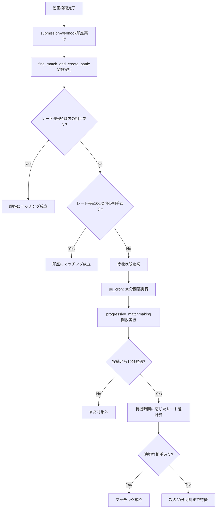

# BeatNexus マッチング・投稿機能仕様書

**最終更新**: 2025年9月26日  
**バージョン**: v8.1.2 (一言コメント UI必須化・i18n対応)  
**適用環境**: 開発環境・本番環境

## 📋 目次
1. [概要](#概要)
2. [投稿システム](#投稿システム)
3. [マッチングシステム](#マッチングシステム)
4. [時間ベース段階的マッチング](#時間ベース段階的マッチング)
5. [自動処理スケジュール](#自動処理スケジュール)
6. [具体的なマッチング例](#具体的なマッチング例)
7. [関数詳細解説](#関数詳細解説)
8. [制限事項・セキュリティ](#制限事項セキュリティ)

---

## 概要

BeatNexusのマッチング・投稿システムは、ビートボクサーが動画を投稿し、適切な相手と自動的にマッチングされてバトルが開始される機能です。レーティングベースの段階的マッチングにより、公平で競争力のあるバトルを実現します。

Cloudflare Streamへの移行により、動画ファイルはクライアントからCloudflareへ直接アップロードし、プラットフォーム側はStreamの動画ID（stream_video_id）を保持して配信状態（stream_status）を同期します。これにより、安定した配信・高速再生・スケーラビリティを確保します。

### 主要な特徴
- **1時間投稿制限**: 1時間に1回の投稿制限（サーバー負荷・ディスク容量抑制）
- **重複バトル防止**: 48時間以内の同じ相手との再マッチを防止
- **シーズン制限**: シーズン状況による投稿制御
- **時間ベース段階的マッチング**: 待機時間に応じて許容レート差が拡大
- **自動処理**: 30分間隔でのマッチメイキング実行
- **Cloudflare Stream 直アップロード**: フロントエンド→Edge Function（upload-video-stream）→Cloudflare直送。動画IDで管理
- **Webhook同期**: CloudflareからのWebhook（stream-webhook）で配信状態・サムネイルを自動更新
- **バトル形式（MAIN/MINI/THEME）**: 投稿時に選択。マッチングは形式ごとに完全分離（MAINとMINIはマッチしない）。
- **形式別動画長さ制約（厳密・包括的）**: MAIN 60–120秒（両端含む）/ MINI 30–60秒（両端含む）/ THEME 30–120秒。
- **UI表記**: バトルカードにbattle_formatタグを表示（詳細はBattleCard仕様参照）。
- NEW: **投稿「一言コメント」**（UI必須・最大140文字・i18n対応）。UIでは必須入力を強制（赤い「必須」バッジ、未入力時の赤枠・エラー表示、送信ボタン無効化）。バックエンドは互換性のため任意（NULL許容）で、非破壊のラッパーRPCにより既存フローを維持。

---

## 投稿システム

### データフロー（v8: Cloudflare Stream移行）

```mermaid
graph TD
  A[ユーザーが動画投稿] --> A1[Edge Function: upload-video-stream で直アップロードURL取得]
  A1 --> A2[Cloudflare Streamへ直アップロード]<-->|Webhook| W[Edge Function: stream-webhook]
  A --> B[1時間投稿制限チェック]
  B --> C[シーズン制限チェック]
  C --> D[投稿作成(create_submission_with_cooldown_check)]
  D -->|stream_video_id保存 / 初期stream_status=pending| E[WAITING_OPPONENT状態]
  W -->|processing/ready等を反映| E
  E --> F[submission-webhook 即座実行]
  F --> G[第1段階: 即時マッチング]
    G --> H{レート差±50以内の相手あり?}
    H -->|Yes| I[即座にマッチング成立]
    H -->|No| J{レート差±100以内の相手あり?}
    J -->|Yes| K[即座にマッチング成立]
    J -->|No| L[待機状態継続]
    L --> M[第2段階: 段階的マッチング開始]
    M --> N[30分間隔でprogressive_matchmaking実行]
    N --> O{投稿から10分経過?}
    O -->|No| P[まだ対象外、次回まで待機]
    O -->|Yes| Q[時間経過に応じたレート差拡大]
    Q --> R[重複バトル防止チェック]
    R --> S[48時間以内の対戦履歴確認]
    S --> T[適切な相手とマッチング]
```

### フォーマット別投稿バリデーション（v8.1）

- 入力項目に battle_format を追加（MAIN_BATTLE / MINI_BATTLE / THEME_CHALLENGE）。
- クライアント側とEdge Functionの両方で動画長さを検証:
  - MAIN_BATTLE: 60秒以上かつ120秒以下（inclusive）
  - MINI_BATTLE: 30秒以上かつ60秒以下（inclusive）
  - THEME_CHALLENGE: 30秒以上かつ120秒以下
- upload-video-stream への要求時、maxDurationSeconds を形式に合わせて設定:
  - MAIN: 120 / MINI: 60 / THEME: 120
- バリデーションNGの場合は投稿を中断し、ユーザーへ理由を表示。

注意: Cloudflare側での超過アップロード防止のため、direct upload発行時のmaxDurationSecondsも必ず設定します。

### 一言コメント（UI必須・v8.1.2）

- 入力（UI）: 必須。前後空白はトリムされ、トリム後の文字数が1文字以上であること。最大長は140文字（両端含む）。140文字を超える入力はクライアント/サーバの両方で拒否。
- 表示仕様（UI）:
  - ラベル: 「一言コメント」の右に赤色の「（必須）」バッジを表示。
  - 未入力時: 入力セクション枠とテキストエリア枠を赤表示し、エラーメッセージを表示。
  - 送信ボタン: 未入力またはトリム後0文字の間は無効化。
  - 文字数カウンタ: トリム後の現在文字数/140 を表示。
- i18n（翻訳キー）:
  - ラベル基底: `postPage.oneLineComment.labelBase`
  - 必須バッジ: `common.required`（例: JA「必須」/ EN "Required"）
  - 未入力エラー: `postPage.oneLineComment.required`（例: JA「一言コメントは必須です」/ EN "One-line comment is required"）
  - プレースホルダ: `postPage.oneLineComment.placeholder`
  - 注記: `postPage.oneLineComment.note`
- 保存先（DB）: `public.submissions.one_line_comment`（NULL許容）。
- バックエンド互換性: システム互換性のため、バックエンドは任意扱い（NULL可）を維持。UI必須により通常は必ずコメントが送信されるが、従来フローとの互換性を担保。
- 呼び出し（RPC）:
  - UIではコメントが必須のため、原則 `create_submission_with_comment` を使用し、`p_comment` にトリム済みの値を渡す。
  - 旧来の `create_submission_with_cooldown_check` は後方互換として維持（UIからは未使用）。
- バリデーション/エラーハンドリング:
  - 140文字超過時は投稿を行わず、下記のエラーを返却。

```json
{
  "success": false,
  "error": "comment_too_long",
  "message_key": "submission.error.commentTooLong",
  "message_params": { "max": 140 }
}
```

  - 未入力（トリム後0）の場合はクライアント側で送信をブロックし、`postPage.oneLineComment.required` を用いてエラー表示する。

### 投稿制限システム

#### 1. 1時間投稿制限
```sql
-- 1時間以内の投稿履歴チェック
SELECT created_at FROM submissions
WHERE user_id = p_user_id
  AND created_at > NOW() - INTERVAL '1 hour'
  AND status != 'withdrawn'
ORDER BY created_at DESC
LIMIT 1;
```

**目的**: 
- **サーバー負荷軽減**: 大量投稿による処理負荷の抑制
- **ディスク容量保護**: 動画ファイルによるストレージ使用量制御
- **システム安定性**: リソース消費の平準化

#### 2. シーズン制限
```sql
SELECT can_submit_video() -- シーズン状況による投稿可否判定
```

#### 3. 重複バトル防止システム
- **制限**: 48時間以内に同じ相手との再マッチを防止
- **対象**: active_battlesとarchived_battlesの両方から履歴チェック
- **効果**: より多様な対戦相手との遭遇機会を提供

#### 4. 投稿ステータス
| ステータス | 説明 | 次の処理 |
|------------|------|----------|
| `WAITING_OPPONENT` | 対戦相手待ち | マッチング対象 |
| `MATCHED_IN_BATTLE` | バトル中 | 投票期間 |
| `withdrawn` | 取り下げ | なし |

#### 5. 配信状態（Cloudflare Stream）
| フィールド | 値 | 説明 |
|------------|----|------|
| `stream_status` | `pending` / `uploading` / `processing` / `ready` / `error` | Webhookで更新される配信状態 |
| `stream_video_id` | 文字列 | Cloudflare Stream の動画UID（direct_uploadで発行） |
| `stream_thumbnail_url` | URL | Cloudflare 生成のサムネイルURL |
| `stream_preview_url` | URL | プレビュー用URL（存在する場合） |
| `stream_error_message` | 文字列 | 変換失敗などのエラー内容 |

---

## マッチングシステム

### 基本原理

BeatNexusのマッチングシステムは**二段階マッチング**方式を採用しています。動画の配信準備（Cloudflareでのprocessing→ready）はWebhookで非同期に進行し、マッチングロジック自体は従来どおり投稿ステータスを基準に動作します。

#### **第1段階: 即時マッチング**
- **実行タイミング**: 投稿直後（数秒以内）
- **実行関数**: `find_match_and_create_battle()`
- **呼び出し元**: submission-webhook Edge Function
- **待機時間**: なし（即座実行）
- **レート差制限**: ±50 → ±100（固定2段階）

#### **第2段階: 段階的マッチング**
- **実行タイミング**: 30分間隔（pg_cron）
- **実行関数**: `progressive_matchmaking()`
- **対象条件**: 投稿から10分経過済み
- **レート差制限**: 時間経過に応じて段階的拡大

### マッチング条件

#### 即時マッチング条件
1. **同じバトルフォーマット**: `battle_format`が一致
2. **異なるユーザー**: 自分自身とはマッチしない
3. **初期待機期間**: なし（即座実行）
4. **レート差制限**: ±50 → ±100（2段階固定）
5. **重複バトル防止**: 基本的な重複チェック

補足（v8.1）: MAIN_BATTLE と MINI_BATTLE は相互にマッチしません（完全分離）。

#### 段階的マッチング条件
1. **同じバトルフォーマット**: `battle_format`が一致
2. **異なるユーザー**: 自分自身とはマッチしない
3. **初期待機期間経過**: 投稿から10分経過
4. **レート差制限**: 時間に応じた許容レート差内
5. **🛡️ 重複バトル防止**: 48時間以内の同じ相手との対戦履歴がない

#### マッチング優先順位
1. **レート差の小ささ**: より近いレーティングを優先
2. **投稿時間の早さ**: より長く待機している投稿を優先

---

## 時間ベース段階的マッチング

### 🎯 二段階マッチングシステム

#### **第1段階: 即時マッチング**
| レート差制限 | 実行タイミング | 設計思想 |
|-------------|-------------|----------|
| **±50** | 投稿直後（第1優先） | 最も近いレート同士の即座マッチング |
| **±100** | 投稿直後（第2優先） | やや広い範囲での即座マッチング |

#### **第2段階: 段階的マッチング（progressive_matchmaking）**
| 待機時間 | 許容レート差 | 設計思想 |
|----------|-------------|----------|
| **0-3時間** | ±100 | 最初の数時間は、質の高いマッチングを維持する |
| **3-12時間** | ±200 | 半日以内に、マッチングの可能性を大きく広げる |
| **12-24時間** | ±400 | 1日待てば、かなり広い範囲の相手とマッチング |
| **24時間以降** | **無制限** | 24時間経過した投稿は、必ず誰かとマッチング |

### 実際のマッチング動作フロー


```mermaid
graph TD
    A[動画投稿完了] --> B[submission-webhook即座実行]
    B --> C[find_match_and_create_battle関数実行]
    C --> D{レート差±50以内の相手あり?}
    D -->|Yes| E[即座にマッチング成立]
    D -->|No| F{レート差±100以内の相手あり?}
    F -->|Yes| G[即座にマッチング成立]
    F -->|No| H[待機状態継続]
    H --> I[pg_cron: 30分間隔実行]
    I --> J[progressive_matchmaking関数実行]
    J --> K{投稿から10分経過?}
    K -->|No| L[まだ対象外]
    K -->|Yes| M[待機時間に応じたレート差計算]
    M --> N{適切な相手あり?}
    N -->|Yes| O[マッチング成立]
    N -->|No| P[次の30分間隔まで待機]
```

### アルゴリズムの実装

#### 即時マッチング（find_match_and_create_battle）
```sql
-- 第1優先: レート差±50以内で検索
SELECT s.* FROM submissions s
JOIN profiles p ON s.user_id = p.id
WHERE s.battle_format = v_submission.battle_format
  AND s.status = 'WAITING_OPPONENT'
  AND s.user_id != v_submission.user_id
  AND ABS(p.rating - v_submitter_rating) <= 50
ORDER BY ABS(p.rating - v_submitter_rating) ASC, s.created_at ASC
LIMIT 1;

-- 第2優先: レート差±100以内で検索（±50で見つからなかった場合）
-- 同様の条件でレート差制限を100に変更
```

#### 段階的マッチング（progressive_matchmaking）
```sql
-- 待機時間に基づく許容レート差の決定
IF v_waiting_hours < 3 THEN
  v_rating_tolerance := 100;
ELSIF v_waiting_hours < 12 THEN
  v_rating_tolerance := 200;
ELSIF v_waiting_hours < 24 THEN
  v_rating_tolerance := 400;
ELSE
  v_rating_tolerance := 999999; -- 無制限
END IF;
```

---

## 自動処理スケジュール

### pg_cronによる定期実行

#### 1. 即時マッチング処理
- **実行タイミング**: 投稿直後（submission-webhook）
- **関数**: `find_match_and_create_battle()`
- **処理内容**: 投稿直後の即座マッチング試行

#### 2. 段階的マッチング処理
- **実行間隔**: 30分ごと
- **関数**: `progressive_matchmaking()`
- **処理内容**: 10分以上待機中の投稿をマッチング

#### 2. バトル終了処理
- **実行間隔**: 5分ごと
- **関数**: `process_expired_battles()`
- **処理内容**: 投票期間終了したバトルの判定

#### 3. その他の定期処理
- **シーズン終了処理**: 毎時実行
- **メールアドレス解放**: 毎日午前2時

---

## 具体的なマッチング例

### 例1: レート1200のプレイヤーAが投稿（即時マッチング成功）

#### 前提条件
- プレイヤーB (レート1180) が既に待機中

#### タイムライン
```
00:00:00 - プレイヤーA (レート1200) が動画投稿
00:00:05 - submission-webhook実行
         → find_match_and_create_battle実行
         → レート差±50(1150-1250)で検索 → プレイヤーB発見（差20）
         → 即座にマッチング成立！
```

#### マッチング結果
- **対戦相手**: プレイヤーB (レート1180)
- **レート差**: 20
- **待機時間**: 5秒
- **マッチング方式**: 即時マッチング（第1段階）
- **投票期間**: 5日間

### 例2: レート1200のプレイヤーAが投稿（段階的マッチング）

#### 前提条件
- 近いレートの待機相手がいない状況

#### タイムライン
```
00:00:00 - プレイヤーA (レート1200) が動画投稿
00:00:05 - submission-webhook実行
         → find_match_and_create_battle実行
         → レート差±50(1150-1250)で検索 → 該当者なし
         → レート差±100(1100-1300)で検索 → 該当者なし
         → 待機状態継続

00:30:00 - pg_cron: progressive_matchmaking実行
         → 投稿から30分経過、10分条件クリア
         → 待機時間0.5時間 → レート差±100で検索
         → 該当者なし → 待機継続

03:30:00 - pg_cron: progressive_matchmaking実行
         → 待機時間3.5時間 → レート差±200で検索（3時間超で緩和）
         → プレイヤーC (レート1180) を発見
         → マッチング成立！
```

#### マッチング結果
- **対戦相手**: プレイヤーC (レート1180)
- **レート差**: 20
- **待機時間**: 3.5時間
- **マッチング方式**: 段階的マッチング（第2段階）
- **投票期間**: 5日間

### 例3: レート800の初心者プレイヤーDが投稿（長期待機パターン）

#### タイムライン
```
月曜 00:00:00 - プレイヤーD (レート800) 投稿
月曜 00:00:05 - 即時マッチング試行 → 該当者なし → 待機継続
月曜 00:10:01 - 段階的マッチング対象に追加
月曜 03:00:00 - レート700-900で検索 → マッチなし
月曜 12:00:00 - レート600-1000で検索 → マッチなし
火曜 00:00:00 - 無制限で検索 → プレイヤーE (レート1100) とマッチ
```

#### マッチング結果
- **対戦相手**: プレイヤーE (レート1100)
- **レート差**: 300
- **待機時間**: 24時間（1日）
- **マッチング方式**: 段階的マッチング（無制限段階）
- **投票期間**: 5日間

---

## 関数詳細解説

### 1. `create_submission_with_cooldown_check()`

#### 目的
動画投稿の制限チェックと新規投稿作成

#### パラメータ・シグネチャ（v8.1 最終）
- 受理シグネチャは以下の2種類のみ（4引数textオーバーロードは廃止し曖昧性を解消）:
  1) `(p_user_id uuid, p_video_url text, p_battle_format battle_format, p_stream_video_id text DEFAULT NULL)`
  2) `(p_user_id uuid, p_video_url text, p_battle_format text)`

推奨利用パターン（Cloudflare Stream経由）:
- Stream直アップロードが成功した場合、`p_stream_video_id` を指定し、`p_video_url` は `NULL` を明示的に渡す（PostgRESTのオーバーロード解決を安定化）。
- 旧来の直リンクフォールバック時のみ（非常手段）、シグネチャ2を使用。

#### 処理フロー
```sql
1. 1時間投稿制限チェック
2. シーズン制限チェック (can_submit_video())
3. 投稿データ作成 (status = 'WAITING_OPPONENT', stream_video_id = p_stream_video_id, stream_status = 'pending', video_url = p_video_url)
4. 結果返却
```

#### バリデーション（形式別動画長さ）
アプリ/Edge双方で形式別の動画長さチェックを実施（MAIN 60–120 / MINI 30–60 / THEME 30–120, すべて両端含む）。

#### 戻り値例（成功）
```json
{
  "success": true,
  "submission_id": "uuid",
  "message": "投稿が正常に作成されました。"
}
```

#### 戻り値例（1時間制限）
```json
{
  "success": false,
  "error": "cooldown_active",
  "message": "1時間以内に投稿できるのは1本までです。次回投稿可能まで: 42分",
  "remaining_seconds": 2520
}
```

#### 関連RPC（ラッパー）: `create_submission_with_comment()`

目的: コメント付きで投稿を作成する際の利便性提供。既存の `create_submission_with_cooldown_check` を内部で呼び出し、成功時のみ `submissions.one_line_comment` を設定します（非破壊）。

パラメータ・シグネチャ:

```
public.create_submission_with_comment(
  p_user_id uuid,
  p_video_url text,
  p_battle_format public.battle_format,
  p_stream_video_id text DEFAULT NULL,
  p_comment text DEFAULT NULL
) returns json SECURITY DEFINER
```

仕様:
- `p_comment` は前後空白をトリム。空文字はNULL扱い。
- 140文字を超える場合、投稿は行わず `comment_too_long` を返却。
- 既存のクールダウン・シーズン・マッチングトリガ等のロジックは、内部で呼び出す既存RPCによりそのまま維持。
- 権限は `authenticated` のみに `EXECUTE` を付与。

エラーレスポンス例（コメント超過）:

```json
{
  "success": false,
  "error": "comment_too_long",
  "message_key": "submission.error.commentTooLong",
  "message_params": { "max": 140 }
}
```

補足（UI/クライアント実装の推奨）:
- 入力がある場合は本RPCを使用、未入力時は既存RPCを使用することで、既存フローとの互換性を保ちます。

### 2. `find_match_and_create_battle()`

#### 目的
投稿直後の即時マッチング処理（第1段階マッチング）

#### パラメータ
- `p_submission_id`: 投稿ID

#### 処理フロー
```sql
1. 投稿詳細の取得
2. 投稿者のレーティング・ユーザー名取得
3. 第1優先: レート差±50以内で対戦相手検索
4. 見つからない場合、第2優先: レート差±100以内で検索
5. マッチした場合、active_battlesにバトル作成
6. 両投稿のステータスをMATCHED_IN_BATTLEに更新
7. マッチング通知を両プレイヤーに送信
```

#### 対戦相手検索条件（第1優先）
```sql
WHERE s.battle_format = v_submission.battle_format
  AND s.status = 'WAITING_OPPONENT'
  AND s.user_id != v_submission.user_id
  AND s.id != p_submission_id
  AND ABS(p.rating - v_submitter_rating) <= 50  -- ±50レート制限
ORDER BY ABS(p.rating - v_submitter_rating) ASC, s.created_at ASC
```

補足（v8.1）: `battle_format`完全一致が必須。MAIN と MINI のクロスマッチングは発生しません。

#### 戻り値例（マッチング成功）
```json
{
  "battle_created": true,
  "battle_id": "uuid",
  "opponent_id": "uuid",
  "voting_ends_at": "2025-07-30T12:00:00Z",
  "message": "Battle created successfully with 5-day voting period",
  "notifications_sent": 2,
  "match_details": {
    "submitter_rating": 1200,
    "opponent_rating": 1180,
    "rating_difference": 20,
    "match_type": "immediate_edge_function",
    "voting_period_days": 5
  }
}
```

#### 戻り値例（マッチング失敗）
```json
{
  "battle_created": false,
  "message": "No suitable opponent found within rating range, submission waiting for progressive matching",
  "waiting": true,
  "submitter_rating": 1200,
  "max_rating_diff_tried": 100
}
```

### 3. `progressive_matchmaking()`

#### 目的
時間ベース段階的マッチング処理（第2段階マッチング）

#### 処理フロー
```sql
1. WAITING_OPPONENT状態の投稿を取得（10分待機済み）
2. 各投稿の待機時間を計算
3. 待機時間に基づく許容レート差を決定
4. 重複バトル防止チェック（48時間以内の対戦履歴確認）
5. 条件に合致する対戦相手を検索
6. マッチした場合、active_battlesにバトル作成
7. 両投稿のステータスをMATCHED_IN_BATTLEに更新
8. マッチング通知を両プレイヤーに送信
```

#### 対戦相手検索条件（重複バトル防止付き）
```sql
WHERE s2.status = 'WAITING_OPPONENT'
  AND s2.id != v_submission_rec.id              -- 自分自身を除外
  AND s2.user_id != v_submission_rec.user_id    -- 同一ユーザーを除外
  AND s2.battle_format = v_submission_rec.battle_format  -- 同じフォーマット
  AND s2.created_at + INTERVAL '10 minutes' <= NOW()     -- 相手も10分待機済み
  AND ABS(p2.rating - v_submitter_rating) <= v_rating_tolerance  -- レート差制限
  -- 🛡️ 重複バトル防止条件: 48時間以内に同じ相手との対戦履歴がないことを確認
  AND NOT EXISTS (
    SELECT 1 FROM public.active_battles ab
    JOIN public.submissions s1 ON (ab.player1_submission_id = s1.id OR ab.player2_submission_id = s1.id)
    JOIN public.submissions s3 ON (ab.player1_submission_id = s3.id OR ab.player2_submission_id = s3.id)
    WHERE ab.created_at >= NOW() - INTERVAL '48 hours'
      AND s1.user_id = v_submission_rec.user_id
      AND s3.user_id = s2.user_id
      AND s1.id != s3.id
  )
ORDER BY ABS(p2.rating - v_submitter_rating) ASC, s2.created_at ASC  -- 優先順位
```

#### 戻り値例
### 4. `upload-video-stream` Edge Function（新規）

#### 目的
Cloudflare Streamのdirect_upload URLを発行し、クライアントが動画を直接Cloudflareにアップロードできるようにする。

#### 入出力（要約）
- 入力: `{ name?: string, requireSignedURLs?: boolean, maxDurationSeconds?: number }`
- 出力: `{ uploadURL: string, uid: string }`（uidが`stream_video_id`）

#### セキュリティ
- クライアント呼び出し想定（CORS許可）。Cloudflare APIトークン（環境変数）必須。

### 5. `stream-webhook` Edge Function（新規）

#### 目的
Cloudflare StreamからのWebhookを受け取り、`submissions`の配信状態を同期する。

#### 入出力（要約）
- 入力: Cloudflare Webhookペイロード（`uid`, `status.state`, `thumbnail`, `preview` など）
- 出力: `{ ok: true }`（同期成功）

#### 動作
1. ヘッダ `cf-webhook-signature` が環境変数 `CLOUDFLARE_STREAM_WEBHOOK_SECRET` と一致することを検証
2. 状態を `uploading|processing|ready|error` に正規化
3. `submissions` を `stream_video_id = uid` で更新（サムネイル/プレビュー/エラーも反映）

#### セキュリティ
- Webhook用にJWT検証は無効（`verify_jwt = false`）。署名ヘッダで保護。

```json
{
  "processed_submissions": 5,
  "matches_created": 2,
  "results": [
    {
      "submission_id": "uuid1",
      "opponent_id": "uuid2",
      "battle_id": "uuid3",
      "submitter_rating": 1200,
      "opponent_rating": 1180,
      "rating_difference": 20,
      "waiting_hours": 3.5,
      "rating_tolerance_used": 200,
      "matched": true,
      "match_type": "progressive_aggressive_with_duplicate_prevention",
      "voting_period_days": 5,
      "duplicate_prevention_active": true,
      "notifications_sent": 2
    }
  ],
  "timestamp": "2025-07-27T12:00:00Z",
  "function_version": "v8_aggressive_time_based_matching",
  "execution_interval": "30_minutes",
  "initial_wait_period": "10_minutes",
  "duplicate_prevention_window": "48_hours",
  "rating_tolerance_schedule": {
    "0_to_3_hours": 100,
    "3_to_12_hours": 200,
    "12_to_24_hours": 400,
    "24_hours_plus": "unlimited"
  }
}
```

### 4. submission-webhook Edge Function

#### 目的
投稿直後の即時マッチング処理を実行するWebhook

#### 呼び出し元
フロントエンド（PostPage.tsx）の投稿処理完了後

#### 処理フロー
```typescript
1. submission_idを受け取り
2. submissionsテーブルから投稿詳細を取得
3. find_match_and_create_battle()関数を実行
4. マッチング結果をフロントエンドに返却
```

#### 実行条件
- 投稿作成直後（create_submission_with_cooldown_check成功後）
- レスポンス速度重視（数秒以内）

#### 戻り値パターン
```typescript
// マッチング成功時
{
  success: true,
  message: "Battle created successfully!",
  battle_id: "uuid",
  matched_with: "uuid"
}

// マッチング失敗時（待機継続）
{
  success: true,
  message: "Submission is waiting for an opponent",
  waiting: true,
  submission_id: "uuid"
}
```

---

## 制限事項・セキュリティ

### 投稿制限
1. **認証必須**: ログインユーザーのみ投稿可能
2. **1時間制限**: 1時間に1回の投稿制限（サーバー負荷・ディスク容量抑制）
3. **シーズン制限**: シーズン状況による制御
4. **重複投稿防止**: 同時に複数の投稿を持てない

### マッチング制限
1. **最低待機時間**: 段階的マッチングは10分間の初期待機が必要（即時マッチングは対象外）
2. **同一ユーザー除外**: 自分自身とはマッチしない
3. **フォーマット一致**: 同じbattle_formatのみマッチ
4. **公平性確保**: レーティングベースの段階的マッチング
5. **重複バトル防止**: 段階的マッチングでは48時間以内の同一相手との対戦を防止

### セキュリティ
```sql
SECURITY DEFINER  -- 関数実行者の権限で実行
GRANT EXECUTE TO authenticated;  -- 認証ユーザーのみ実行可能
```

補足（v8.1.1 一言コメント）:
- DBレベルで `CHECK (one_line_comment IS NULL OR char_length(one_line_comment) <= 140)` を付与し、アプリ/関数レベルの二重チェックで安全性を確保。
- `create_submission_with_comment` は SECURITY DEFINER を用い、直後のコメント設定をRLSに阻害されずに実行。

#### Edge Functions（追加）
- `upload-video-stream`: CORS許可。Cloudflare API用の環境変数が必要。
- `stream-webhook`: `verify_jwt = false`（JWT不要）。`cf-webhook-signature` ヘッダでCloudflare→Supabase間を検証。`SUPABASE_SERVICE_ROLE_KEY` でDB更新。

---

## パフォーマンス最適化

### インデックス設計
```sql
-- 効率的なマッチング検索のためのインデックス
CREATE INDEX idx_submissions_waiting_matchmaking ON submissions(status, battle_format, created_at)
WHERE status = 'WAITING_OPPONENT';

CREATE INDEX idx_submissions_user_cooldown ON submissions(user_id, created_at)
WHERE created_at > NOW() - INTERVAL '24 hours';

-- Cloudflare Stream 同期のためのインデックス
CREATE INDEX IF NOT EXISTS idx_submissions_stream_video_id ON submissions(stream_video_id);
CREATE INDEX IF NOT EXISTS idx_submissions_stream_status ON submissions(stream_status);
```

### バッチ処理
- **即時マッチング**: 投稿直後の単発処理（submission-webhook）
- **段階的マッチング**: 30分間隔で一括処理（progressive_matchmaking）
- **バトル終了**: 5分間隔で一括処理
- **効率的な検索**: インデックスを活用した高速クエリ

---

## 今後の改善予定

### 検討中の機能
1. **優先マッチング**: プレミアムユーザー向け高速マッチング
2. **地域別マッチング**: タイムゾーンを考慮したマッチング
3. **スキル別カテゴリ**: ジャンル特化型マッチング
4. **トーナメントモード**: 複数人参加の大会形式

---

## 関連ドキュメント
- [投票機能仕様書](./投票機能仕様書.md)
- [シーズンシステム仕様書](./シーズンシステム仕様書.md)
- [BeatNexus.mdc](./BeatNexus.mdc) - プロジェクト全体仕様

---

**注意**: この仕様書は、二段階マッチングに加えてCloudflare Streamによる配信同期（upload → webhook → 再生）の最新フローを反映しています。即時マッチング（投稿直後）と段階的マッチング（30分間隔）は従来どおり並行して動作します。
