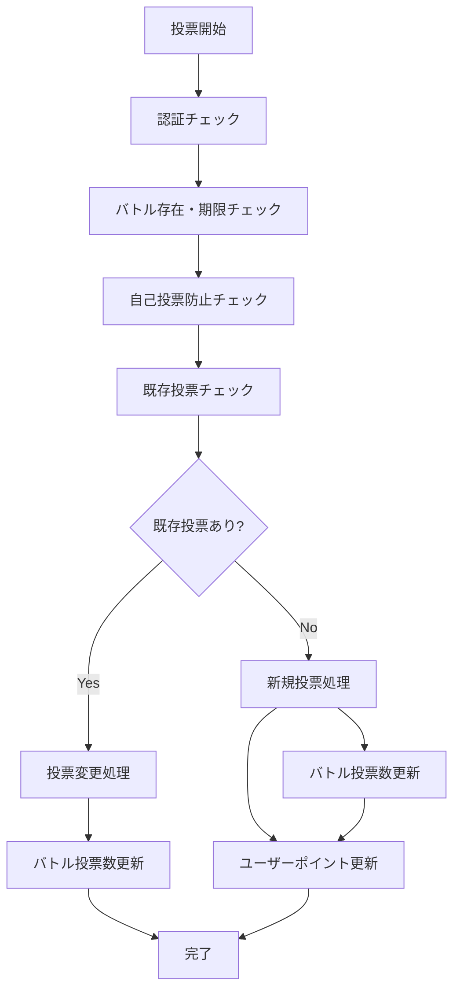

# BeatNexus 投票機能仕様書

**最終更新**: 2025年7月23日  
**バージョン**: v6 (Fixed Vote Count)  
**適用環境**: 開発環境・本番環境

## 📋 目次
1. [概要](#概要)
2. [投票システムの基本構造](#投票システムの基本構造)
3. [投票関数仕様](#投票関数仕様)
4. [ポイントシステム](#ポイントシステム)
5. [投票キャンセル機能](#投票キャンセル機能)
6. [シーズンシステム連携](#シーズンシステム連携)
7. [セキュリティ・制限事項](#セキュリティ制限事項)
8. [エラーハンドリング](#エラーハンドリング)
9. [テスト結果・検証](#テスト結果検証)

---

## 概要

BeatNexusの投票機能は、ビートボクサー同士のバトルに対してコミュニティが投票を行うシステムです。投票者は通算ランキングとシーズンランキングの両方でポイントを獲得し、コミュニティ貢献度を評価されます。

### 主要機能
- **通常投票**: シンプルなA/B投票（+1ポイント）
- **コメント付き投票**: コメント付きA/B投票（+3ポイントボーナス）
- **投票変更**: 既存投票の変更（追加ポイントなし）
- **投票キャンセル**: 投票の取り消し（ポイント減算）

---

## 投票システムの基本構造

### データベーステーブル

#### `battle_votes`
```sql
battle_votes (
  id uuid PRIMARY KEY,
  battle_id uuid NOT NULL REFERENCES active_battles(id),
  user_id uuid REFERENCES profiles(id),
  vote char(1) CHECK (vote IN ('A', 'B')),
  comment text,
  season_id uuid REFERENCES seasons(id),
  created_at timestamptz DEFAULT now()
)
```

#### `profiles` (投票関連フィールド)
```sql
profiles (
  vote_count integer DEFAULT 0,          -- 通算投票カウント
  season_vote_points integer DEFAULT 0   -- シーズン投票ポイント
)
```

---

## 投票関数仕様

### 1. `vote_battle(p_battle_id, p_vote)`

#### 基本仕様
- **目的**: 通常の投票処理
- **パラメータ**:
  - `p_battle_id`: バトルID (uuid)
  - `p_vote`: 投票対象 ('A' または 'B')

#### 動作フロー


#### ポイント更新ルール
| シーズン状態 | vote_count増加 | season_vote_points増加 |
|-------------|----------------|----------------------|
| アクティブ | +1 | +1 |
| 非アクティブ | +1 | +0 |

#### 戻り値例
```json
{
  "success": true,
  "vote": "A",
  "existing_vote": null,
  "season_id": "3bb457fc-c694-4035-926d-7990ceb50589",
  "season_vote_points_added": 1,
  "vote_count_added": 1,
  "vote_type": "simple_vote"
}
```

### 2. `vote_battle_with_comment(p_battle_id, p_vote, p_comment)`

#### 基本仕様
- **目的**: コメント付き投票処理（ボーナスポイント付き）
- **パラメータ**:
  - `p_battle_id`: バトルID (uuid)
  - `p_vote`: 投票対象 ('A' または 'B')
  - `p_comment`: コメント内容 (text)

#### ポイント更新ルール
| シーズン状態 | vote_count増加 | season_vote_points増加 |
|-------------|----------------|----------------------|
| アクティブ | +3 | +3 |
| 非アクティブ | +3 | +0 |

#### 戻り値例
```json
{
  "success": true,
  "vote": "B",
  "comment": "リズムが完璧！🎵",
  "season_id": "3bb457fc-c694-4035-926d-7990ceb50589",
  "season_found": true,
  "season_vote_points_added": 3,
  "vote_count_added": 3,
  "vote_type": "comment_vote"
}
```

---

## ポイントシステム

### 通算投票カウント（vote_count）
- **特徴**: **シーズンの有無に関係なく常に更新**
- **用途**: 全期間を通じた投票者ランキング
- **増加量**:
  - 通常投票: +1
  - コメント付き投票: +3
- **減少**: 投票キャンセル時のみ

### シーズン投票ポイント（season_vote_points）
- **特徴**: **アクティブなシーズンがある場合のみ更新**
- **用途**: シーズン限定の投票者ランキング
- **増加量**:
  - 通常投票: +1 (シーズンアクティブ時)
  - コメント付き投票: +3 (シーズンアクティブ時)
- **リセット**: 新シーズン開始時に0にリセット

### 重要な設計原則

#### ✅ 修正後の動作（v6）
```
新規投票時:
- vote_count: 必ず増加（シーズンの有無に関係なく）
- season_vote_points: シーズンがアクティブな場合のみ増加

投票変更時:
- どちらのポイントも変化なし

投票キャンセル時:
- vote_count: 必ず減少
- season_vote_points: 元の投票がseason_id付きの場合のみ減少
```

---

## 投票キャンセル機能

### `cancel_vote(p_battle_id)`

#### 基本仕様
- **目的**: 既存投票の取り消し
- **パラメータ**: `p_battle_id` (uuid)

#### 動作ルール
1. **投票存在チェック**: ユーザーが該当バトルに投票済みかチェック
2. **ポイント減算**:
   - `vote_count`: 元の投票タイプに応じて減算
   - `season_vote_points`: 元の投票に`season_id`がある場合のみ減算
3. **投票データ削除**: `battle_votes`テーブルから削除
4. **バトル投票数更新**: `active_battles`の`votes_a`/`votes_b`を減算

#### 減算ルール
| 元の投票タイプ | 元のseason_id | vote_count減算 | season_vote_points減算 |
|---------------|--------------|----------------|----------------------|
| 通常投票 | NULL | -1 | 0 |
| 通常投票 | あり | -1 | -1 |
| コメント付き | NULL | -3 | 0 |
| コメント付き | あり | -3 | -3 |

---

## シーズンシステム連携

### アクティブシーズンの判定
```sql
SELECT * FROM public.seasons
WHERE status = 'active'
  AND start_at <= NOW()
  AND end_at >= NOW()
ORDER BY start_at DESC
LIMIT 1;
```

### シーズン状態による動作の違い

#### シーズンがアクティブな場合
- ✅ `vote_count` 増加
- ✅ `season_vote_points` 増加
- ✅ 投票に `season_id` 設定

#### シーズンが非アクティブな場合
- ✅ `vote_count` 増加
- ❌ `season_vote_points` 増加なし
- ❌ 投票の `season_id` は `NULL`

---

## セキュリティ・制限事項

### 投票制限
1. **認証必須**: `auth.uid()` が必要
2. **自己投票禁止**: バトル参加者は自分のバトルに投票不可
3. **重複投票制御**: 1ユーザー1バトル1投票のみ
4. **期限チェック**: `end_voting_at` 以降は投票不可
5. **バトル状態チェック**: `status = 'ACTIVE'` のバトルのみ

### セキュリティレベル
```sql
SECURITY DEFINER  -- 関数実行者の権限で実行
```

### 権限設定
```sql
GRANT EXECUTE ON FUNCTION vote_battle TO authenticated;
GRANT EXECUTE ON FUNCTION vote_battle_with_comment TO authenticated;
GRANT EXECUTE ON FUNCTION cancel_vote TO authenticated;
```

---

## エラーハンドリング

### 一般的なエラー
| エラーコード | 原因 | メッセージ |
|-------------|------|-----------|
| 認証エラー | `auth.uid()` が NULL | "Not authenticated" |
| 無効な投票 | vote が 'A'/'B' 以外 | "Invalid vote" |
| バトル未発見 | 存在しないbattle_id | "Battle not found or not active" |
| 期限切れ | 投票期間終了 | "Voting period has ended" |
| 自己投票 | 参加者が自分に投票 | "Cannot vote on your own battle" |

### エラーレスポンス例
```json
{
  "success": false,
  "error": "Cannot vote on your own battle"
}
```

---

## テスト結果・検証

### 2025年7月23日実施テスト

#### テスト環境
- **開発環境**: `wdttluticnlqzmqmfvgt`
- **テストユーザー**: RIKUJI2 (`017a2db2-7274-44cc-a25a-82176c7e3d42`)

#### テストケース結果

| # | シーズン状態 | 投票タイプ | 期待結果 | 実際の結果 | ステータス |
|---|-------------|-----------|----------|-----------|-----------|
| 1 | 非アクティブ | 通常投票 | vote_count: +1, season_vote_points: +0 | ✅ 正常 | PASS |
| 2 | 非アクティブ | 投票キャンセル | vote_count: -1, season_vote_points: +0 | ✅ 正常 | PASS |
| 3 | 非アクティブ | コメント付き投票 | vote_count: +3, season_vote_points: +0 | ✅ 正常 | PASS |
| 4 | アクティブ化 | シーズン切り替え | 2025-S7をアクティブに | ✅ 正常 | PASS |
| 5 | アクティブ | 投票キャンセル | 既存投票(season_id=null)のキャンセル | ✅ 正常 | PASS |
| 6 | アクティブ | 通常投票 | vote_count: +1, season_vote_points: +1 | ✅ 正常 | PASS |
| 7 | アクティブ | 投票キャンセル | season_id付き投票のキャンセル | ✅ 正常 | PASS |
| 8 | アクティブ | コメント付き投票 | vote_count: +3, season_vote_points: +3 | ✅ 正常 | PASS |

#### 最終検証結果
- **最終状態**: `vote_count: 5, season_vote_points: 3`
- **全テストケース**: ✅ PASS
- **本番環境適用**: ✅ 完了

### パフォーマンス考慮事項
- **インデックス**: `battle_votes(battle_id, user_id)` 複合インデックス推奨
- **トランザクション**: 各投票関数は単一トランザクションで完結
- **エラー処理**: 堅牢なエラーハンドリングによる安全性確保

---

## 改善履歴

### v6 (2025-07-23) - Fixed Vote Count
**問題**: シーズンが非アクティブな場合、通算投票カウントが更新されない  
**解決**: vote_countはシーズンの有無に関係なく常に更新するよう修正

### 主要な変更点
1. **vote_battle関数**: vote_countを常に+1、season_vote_pointsはシーズンアクティブ時のみ+1
2. **vote_battle_with_comment関数**: vote_countを常に+3、season_vote_pointsはシーズンアクティブ時のみ+3
3. **cancel_vote関数**: 既存実装を維持（適切に動作済み）

---

## 関連ドキュメント
- [シーズンシステム仕様書](./シーズンシステム仕様書.md)
- [ランキングシステム仕様書](./ランキングシステム仕様書.md)
- [BeatNexus.mdc](./BeatNexus.mdc) - プロジェクト全体仕様

---

**注意**: この仕様書は実際のテスト結果に基づいて作成されており、開発環境・本番環境両方で動作確認済みです。
