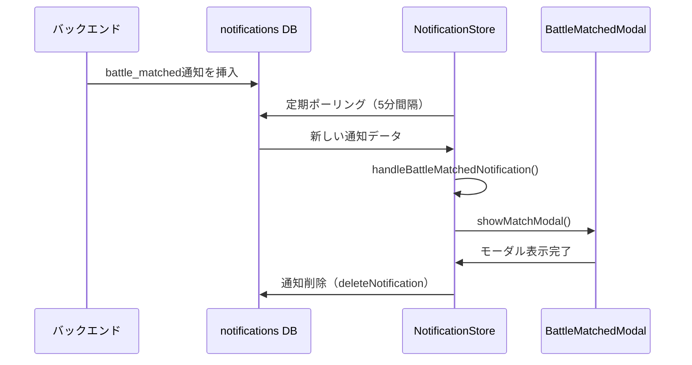
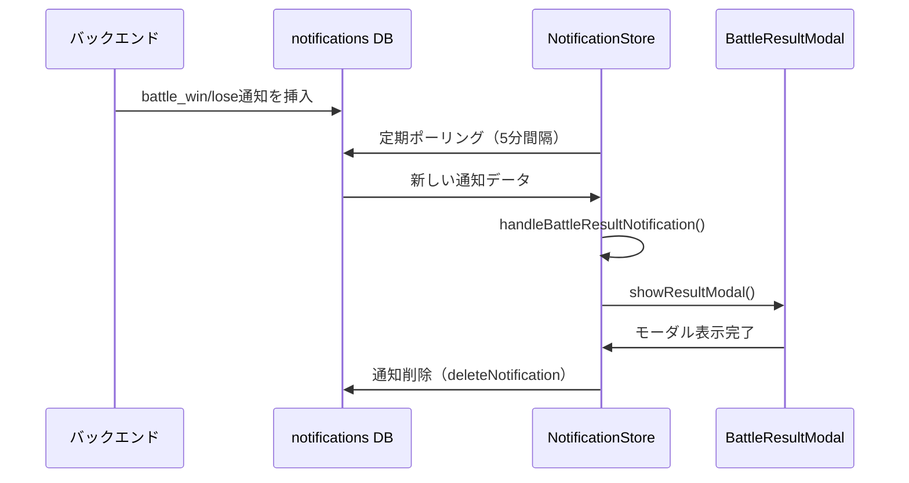

# BeatNexus 通知システム仕様書

作成日: 2025年7月22日  
対象: バトルマッチング・バトル結果・シーズン開始通知システム

## 1. システム概要

BeatNexusの通知システムは、データベースベースの通知管理とリアルタイム更新を組み合わせた仕組みです。主要な特徴：

- **データベース中心**: `notifications`テーブルによる永続化
- **リアルタイム性**: 定期的なポーリング（5分間隔）
- **モーダル自動表示**: 特定タイプの通知は自動でモーダル表示
- **状態管理**: Zustandストアによるクライアント側管理

## 2. データベース構造

### 2.1 notificationsテーブル

| カラム名 | データ型 | 必須 | デフォルト | 説明 |
|---------|----------|------|------------|------|
| id | uuid | YES | gen_random_uuid() | 通知ID |
| user_id | uuid | YES | - | 対象ユーザーID |
| title | text | YES | - | 通知タイトル |
| message | text | YES | - | 通知メッセージ |
| type | varchar | YES | - | 通知タイプ |
| is_read | boolean | YES | false | 既読フラグ |
| related_battle_id | uuid | NO | - | 関連バトルID |
| created_at | timestamptz | YES | now() | 作成日時 |
| updated_at | timestamptz | YES | now() | 更新日時 |

### 2.2 通知タイプ

```typescript
type NotificationType = 
  | 'info'           // 一般情報
  | 'success'        // 成功通知
  | 'warning'        // 警告
  | 'battle_matched' // バトルマッチング通知
  | 'battle_win'     // バトル勝利通知
  | 'battle_lose'    // バトル敗北通知
  | 'battle_draw'    // バトル引き分け通知
```

## 3. 通知処理フロー

### 3.1 バトルマッチング通知フロー



### 3.2 バトル結果通知フロー



## 4. クライアント側実装

### 4.1 NotificationStoreの主要機能

#### データ取得・管理
- `fetchNotifications()`: DBから通知一覧を取得
- `subscribeToNotifications()`: 定期ポーリング開始
- `createNotification()`: 新規通知作成

#### 自動モーダル表示ロジック
```typescript
// fetchNotifications内で実行
const pendingBattleResult = notifications.find(
  (n) => !n.isRead && 
  (n.type === 'battle_win' || n.type === 'battle_lose') && 
  n.relatedBattleId
);

if (pendingBattleResult) {
  handleBattleResultNotification(pendingBattleResult);
}

const pendingBattleMatched = notifications.find(
  (n) => !n.isRead && 
  n.type === 'battle_matched' && 
  n.relatedBattleId
);

if (pendingBattleMatched) {
  handleBattleMatchedNotification(pendingBattleMatched);
}
```

### 4.2 ヘルパー関数

#### handleBattleMatchedNotification()
1. 通知の`relatedBattleId`から`active_battles`データ取得
2. プレイヤー情報取得
3. `BattleMatchedModal`用データ構築
4. `useBattleMatchedStore.showMatchModal()`呼び出し
5. 通知をDBから削除

#### handleBattleResultNotification()
1. 通知の`relatedBattleId`から`archived_battles`データ取得
2. 現在ユーザーの勝敗・レーティング変動計算
3. `BattleResultModal`用データ構築
4. `useBattleResultStore.showResultModal()`呼び出し
5. 通知をDBから削除

## 5. App.tsx統合

```typescript
// App.tsx内
useEffect(() => {
  if (user) {
    // 通知のリアルタイム更新を購読
    const unsubscribeNotifications = subscribeToNotifications();
    
    // 初期の通知データを取得
    fetchNotifications();

    return () => {
      unsubscribeNotifications();
    };
  }
}, [user, subscribeToNotifications, fetchNotifications]);
```

## 6. 重要な特徴

### 6.1 自動削除メカニズム
- モーダル表示後、該当通知を自動削除
- 重複表示を防止
- データベースの肥大化防止

### 6.2 エラーハンドリング
- 通知データ取得エラー時の適切な処理
- バトルデータ不整合時のフォールバック
- ユーザー認証状態の確認

### 6.3 パフォーマンス考慮
- WebSocket接続の不安定性に対応し定期ポーリング採用
- 5分間隔での更新でサーバー負荷軽減
- Zustand persistによるクライアント側キャッシュ

## 7. 今後の拡張ポイント

### 7.1 新しい通知タイプ追加時の手順
1. `NotificationType`に新しいタイプを追加
2. 専用ヘルパー関数作成（例: `handleNewSeasonNotification`）
3. `fetchNotifications`内に自動検出ロジック追加
4. 対応するモーダルストア統合

### 7.2 シーズン開始通知の実装要件
- 通知タイプ: `'season_start'`
- 関連データ: 新シーズンID
- モーダル: `NewSeasonModal`
- ストア連携: `useModalStore.openNewSeasonModal()`

## 8. セキュリティ考慮事項

- 通知は`user_id`でスコープ制限
- 関連バトルデータのアクセス権限確認
- 認証状態の適切な検証

---

この仕様書を基に、シーズン開始通知システムを既存アーキテクチャに統合します。
